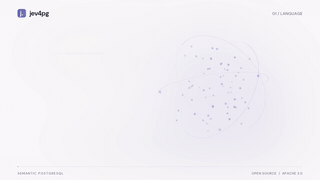
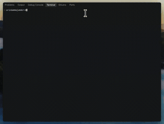

# Awesome TypeSafe Jev

[English](README.md)

基于 **TypeSafe Jev** 决策模型的开源项目:Agent 与电脑操作、开发者工具、SDK 与 MCP、分类与业务应用、开源复现。共 315 个仓库,每个都由 [Agent Skills Hub](https://agentskillshub.top?utm_source=github&utm_medium=awesome-list) 读过 README 并做了安全评级。

带类型筛选的在线页面:**[https://agentskillshub.top/best/typesafe-jev/](https://agentskillshub.top/best/typesafe-jev/?utm_source=github&utm_medium=awesome-list)** · 每 8 小时刷新

## 这些项目长什么样

<table>
<tr>
<td align="center" valign="top" width="33%"><b>🧱 综合框架</b> 66 个仓库   覆盖多种 Jev 用法的平台和框架。 <a href="#type-general"><b>查看列表 →</b></a></td>
<td align="center" valign="top" width="33%"><b>🔁 开源替代与复现</b> 60 个仓库  复现或替代 Jev 的开源模型和服务,可自托管。 <a href="#type-replica"><b>查看列表 →</b></a></td>
<td align="center" valign="top" width="33%"><b>🤖 Agent 与电脑操作</b> 31 个仓库  会动手的 Agent:浏览器与电脑操作、游戏、任务执行。 <a href="#type-agent"><b>查看列表 →</b></a></td>
</tr>
<tr>
<td align="center" valign="top" width="33%"><b>🧩 开发者工具</b> 86 个仓库   编程 Agent 插件、代码搜索与审查、模型路由、上下文压缩。 <a href="#type-devtool"><b>查看列表 →</b></a></td>
<td align="center" valign="top" width="33%"><b>🔌 SDK、MCP 与接口</b> 39 个仓库   调用 Jev 的客户端库、MCP 服务和本地接口。 <a href="#type-sdk"><b>查看列表 →</b></a></td>
<td align="center" valign="top" width="33%"><b>🏷 分类与业务应用</b> 15 个仓库  文档分类、财税、交易、工单分诊。 <a href="#type-business"><b>查看列表 →</b></a></td>
</tr>
<tr>
<td align="center" valign="top" width="33%"><b>💬 聊天与个人应用</b> 18 个仓库  聊天助手、智能输入、个人记忆。 <a href="#type-consumer"><b>查看列表 →</b></a></td>
</tr>
</table>

## 目录

- [🧱 综合框架](#type-general) (66)
- [🔁 开源替代与复现](#type-replica) (60)
- [🤖 Agent 与电脑操作](#type-agent) (31)
- [🧩 开发者工具](#type-devtool) (86)
- [🔌 SDK、MCP 与接口](#type-sdk) (39)
- [🏷 分类与业务应用](#type-business) (15)
- [💬 聊天与个人应用](#type-consumer) (18)

## 什么样的仓库能上榜

1. 它用到 Jev:调用、封装,或复现、替代这个模型。只是提到 Jev,或者恰好也叫 Jev 的别的项目,不算。
2. 它是能安装或运行的软件,不是链接合集或空仓库。
3. 它有 README。没有 README 就没法评级。
4. 50 星及以上只看是否切题;50 星以下还要达到 README 质量线的最高档(展示效果、一条命令上手、说清产出、文档完整),并且至少 5 星。

这些问题由 Jev 自己逐个读 README 回答,不是人工挑选。卡在线上的仓库可能判到任一边,归错了请提 issue。

## 🧱 综合框架

[在在线页面打开这一类,按星数排序 →](https://agentskillshub.top/best/typesafe-jev/?utm_source=github&utm_medium=awesome-list#type-general)

| 仓库 | 星数 | 做什么 | 安全评级 |
|---|---:|---|---|
| [nokia-applied-research/AnyJev](https://github.com/nokia-applied-research/AnyJev) | 1.1k | 将任意 LLM 转为 Jev 风格决策模型：类型化决策、真实概率、无需训练。持续更新，欢迎提交 issue 和 PR。 | [SAFE](https://agentskillshub.top/skill/nokia-applied-research/AnyJev/?utm_source=github&utm_medium=awesome-list) |
| [kerpopule/hermes-jev-skills](https://github.com/kerpopule/hermes-jev-skills) | 1.0k | 基于Jev的模型路由、记忆、压缩、skill选择及Hermes agents的电脑和浏览器操作（支持Claude Code和Codex） | [SAFE](https://agentskillshub.top/skill/kerpopule/hermes-jev-skills/?utm_source=github&utm_medium=awesome-list) |
| [TianyuCodings/JevHarness](https://github.com/TianyuCodings/JevHarness) | 525 | 由 LLM 编写的特定任务 Jev harness，支持完整轨迹奖励反思和 GEPA 演化。 | [SAFE](https://agentskillshub.top/skill/TianyuCodings/JevHarness/?utm_source=github&utm_medium=awesome-list) |
| [superagents-lab/jev-search](https://github.com/superagents-lab/jev-search) | 512 | 使用 TypeSafe 的 Jev 搜索网页：来源选择、查询理解和相关性排序。基于 Search1API 构建。 | [SAFE](https://agentskillshub.top/skill/superagents-lab/jev-search/?utm_source=github&utm_medium=awesome-list) |
| [jkudish/jev-mcp](https://github.com/jkudish/jev-mcp) | 501 | 将 TypeSafe 的 Jev 模型提供的快速、低成本、类型化判断作为 MCP 工具。 | [SAFE](https://agentskillshub.top/skill/jkudish/jev-mcp/?utm_source=github&utm_medium=awesome-list) |
| [dabit3/jev-experiments](https://github.com/dabit3/jev-experiments) | 399 | Jev 实验：Devin 构建的延迟演示。每个应用有独立顶层目录、README、TESTING.md 和截图。 | [SAFE](https://agentskillshub.top/skill/dabit3/jev-experiments/?utm_source=github&utm_medium=awesome-list) |
| [kitze/unclutter](https://github.com/kitze/unclutter) | 359 | WXT 浏览器扩展：基于 Jev 清除页面杂乱内容，支持可复用模板规则。 | [SAFE](https://agentskillshub.top/skill/kitze/unclutter/?utm_source=github&utm_medium=awesome-list) |
| [sutro-sh/jev-align](https://github.com/sutro-sh/jev-align) | 304 | 使用 Jev 和 GEPA 基于人工反馈构建校准的 AI Functions。 | [SAFE](https://agentskillshub.top/skill/sutro-sh/jev-align/?utm_source=github&utm_medium=awesome-list) |
| [anteloc/ldraw-nova](https://github.com/anteloc/ldraw-nova) | 289 | 用于生成式 LEGO 模型构建的 agent 工具，基于 Astra 和 Opus 5.5，由 Jev 驱动 | [SAFE](https://agentskillshub.top/skill/anteloc/ldraw-nova/?utm_source=github&utm_medium=awesome-list) |
| [monteduro/killmyidea](https://github.com/monteduro/killmyidea) | 256 | 描述你的创业想法。Jev 决定：放弃、改进还是发布。 | [SAFE](https://agentskillshub.top/skill/monteduro/killmyidea/?utm_source=github&utm_medium=awesome-list) |
| [RomanSlack/jev-drone](https://github.com/RomanSlack/jev-drone) | 251 | 在 MuJoCo 中，仅用摄像头的自主无人机，由小型判断模型（TypeSafe Jev）以 2.5Hz 参与闭环 | [SAFE](https://agentskillshub.top/skill/RomanSlack/jev-drone/?utm_source=github&utm_medium=awesome-list) |
| [HarnessRouter/SystemOneHarness](https://github.com/HarnessRouter/SystemOneHarness) | 202 | System One 模型的运行框架。在本地或通过 HarnessRouter.ai 运行 Jev 等 System One 模型。 | [SAFE](https://agentskillshub.top/skill/HarnessRouter/SystemOneHarness/?utm_source=github&utm_medium=awesome-list) |
| [disler/ten-levels-of-jev](https://github.com/disler/ten-levels-of-jev) | 195 | Jev的十个层级：从一个聪明的if语句，到会自行调用Jev的编码agent | [SAFE](https://agentskillshub.top/skill/disler/ten-levels-of-jev/?utm_source=github&utm_medium=awesome-list) |
| [datawhalechina/jev-cookbook](https://github.com/datawhalechina/jev-cookbook) | 184 | Jev 入门：用 Jupyter Notebook 实验问题原语、实战配方、语音智能家居、模型评测与本地微调，了解 System One 判断模型开发范式 | [SAFE](https://agentskillshub.top/skill/datawhalechina/jev-cookbook/?utm_source=github&utm_medium=awesome-list) |
| [libingzheren/Jev-Mem](https://github.com/libingzheren/Jev-Mem) | 175 | Jev-Mem：由 System-One 控制的智能体记忆 | [SAFE](https://agentskillshub.top/skill/libingzheren/Jev-Mem/?utm_source=github&utm_medium=awesome-list) |
| [jexp/neo4jev](https://github.com/jexp/neo4jev) | 166 | Typesafe.ai System One Model Jev 使用邻接关系分类器遍历 Neo4j 图 | [SAFE](https://agentskillshub.top/skill/jexp/neo4jev/?utm_source=github&utm_medium=awesome-list) |
| [CTNicholas/jev-workflow-builder](https://github.com/CTNicholas/jev-workflow-builder) | 148 | Jev 工作流构建器：用 Liveblocks 实现多人工作流，连接 Jev 与 LLM，调用 REST API 并预览测试运行。 | [SAFE](https://agentskillshub.top/skill/CTNicholas/jev-workflow-builder/?utm_source=github&utm_medium=awesome-list) |
| [uehaj/sys1grep](https://github.com/uehaj/sys1grep) | 147 | 按语义跨语言 grep。TypeSafe Jev 为每行评分，支持用 AND/OR/NOT 组合语义；可用日语搜英语，也可反向搜索。 | [SAFE](https://agentskillshub.top/skill/uehaj/sys1grep/?utm_source=github&utm_medium=awesome-list) |
| [wquguru/dasheng](https://github.com/wquguru/dasheng) | 144 | 大声读：R2T2 流式 ASR 听，Jev 逐词判，英文朗读评分 | [SAFE](https://agentskillshub.top/skill/wquguru/dasheng/?utm_source=github&utm_medium=awesome-list) |
| [Sheltercosmo/jev4pg](https://github.com/Sheltercosmo/jev4pg) | 143 | 基于 JEV 的自然语言转 SQL 性能良好，PostgreSQL(PG) 语义算子覆盖完善；可复用证据、原生执行、并行计划和可解释嵌入正在开发预览中。 | [SAFE](https://agentskillshub.top/skill/Sheltercosmo/jev4pg/?utm_source=github&utm_medium=awesome-list) |
| [artemnovitckii/creator-lab](https://github.com/artemnovitckii/creator-lab) | 139 | 使用 Apify、Jev 和 Fireworks 或 Groq 研究 Instagram Reel 脚本。自备密钥，比较开头并记录模式。 | [SAFE](https://agentskillshub.top/skill/artemnovitckii/creator-lab/?utm_source=github&utm_medium=awesome-list) |
| [keltokhy/jgrep](https://github.com/keltokhy/jgrep) | 136 | grep，但模式是描述。使用 TypeSafe 的 Jev 决策模型按含义筛选行，每行约 200 毫秒，每行成本约千分之一美分。 | [SAFE](https://agentskillshub.top/skill/keltokhy/jgrep/?utm_source=github&utm_medium=awesome-list) |
| [cobusgreyling/Jev](https://github.com/cobusgreyling/Jev) | 133 | 非官方 TypeSafe Jev 展示：System One 决策，不是聊天 | [SAFE](https://agentskillshub.top/skill/cobusgreyling/Jev/?utm_source=github&utm_medium=awesome-list) |
| [sdras/jev-webmcp-extension](https://github.com/sdras/jev-webmcp-extension) | 128 | 演示 Jev 与 WebMCP 组合的小型扩展 | [SAFE](https://agentskillshub.top/skill/sdras/jev-webmcp-extension/?utm_source=github&utm_medium=awesome-list) |
| [ThinkFlowLab/system1-agents](https://github.com/ThinkFlowLab/system1-agents) | 119 | System 1决策模型（Jev、Laya、Cua-S1）：agent的大脑，用于浏览器、电脑、游戏和机器人操作 | [SAFE](https://agentskillshub.top/skill/ThinkFlowLab/system1-agents/?utm_source=github&utm_medium=awesome-list) |
| [NanmiCoder/jev-arena](https://github.com/NanmiCoder/jev-arena) | 116 | Jev：将自然语言转为带类型的判断与概率，用于分类、评分和路由；支持模型对比、表格导入、回放与离线报告。 | [SAFE](https://agentskillshub.top/skill/NanmiCoder/jev-arena/?utm_source=github&utm_medium=awesome-list) |
| [trungdq88/youtube-sponsor-detection](https://github.com/trungdq88/youtube-sponsor-detection) | 110 | 使用实时音频和字幕检测 YouTube 赞助片段，由 Jev 提供支持 | [SAFE](https://agentskillshub.top/skill/trungdq88/youtube-sponsor-detection/?utm_source=github&utm_medium=awesome-list) |
| [ChetasLua/jevmeter](https://github.com/ChetasLua/jevmeter) | 107 | 为任意视频添加实时 Jev (TypeSafe) 计量器：逐句评分，渲染为 16:9 成片 | [SAFE](https://agentskillshub.top/skill/ChetasLua/jevmeter/?utm_source=github&utm_medium=awesome-list) |
| [vinilana/jev-eval-agent](https://github.com/vinilana/jev-eval-agent) | 106 | 基于 eve 的个人助理 agent，含100个模拟工具，经 OpenRouter 提供；比较 LLM 自选工具与 Jev（TypeSafe 分类器）选工具完… | [SAFE](https://agentskillshub.top/skill/vinilana/jev-eval-agent/?utm_source=github&utm_medium=awesome-list) |
| [kyle-pena-nlp/jevchat](https://github.com/kyle-pena-nlp/jevchat) | 96 | 把 Jev 变成聊天机器人 | [SAFE](https://agentskillshub.top/skill/kyle-pena-nlp/jevchat/?utm_source=github&utm_medium=awesome-list) |
| [PyModel/jev-judge-mcp](https://github.com/PyModel/jev-judge-mcp) | 92 | MCP agent 类型化判断工具：TypeSafe Jev 模型执行验证/筛选/查找/分类/重排/决策/比较/提取/审查/门控/评分；策略决定自动、审核或升… | [SAFE](https://agentskillshub.top/skill/PyModel/jev-judge-mcp/?utm_source=github&utm_medium=awesome-list) |
| [fazlerocks/jevmail](https://github.com/fazlerocks/jevmail) | 92 | Gmail 邮件分类工具：Jev、TypeSafe AI、Vercel AI Gateway；分类为需回复、更新、促销、销售、垃圾邮件；只读、本地运行。 | [SAFE](https://agentskillshub.top/skill/fazlerocks/jevmail/?utm_source=github&utm_medium=awesome-list) |
| [realZachi/typesafe-adblock](https://github.com/realZachi/typesafe-adblock) | 89 | Chrome 扩展用小型 AI 决策模型 TypeSafe Jev 判断并移除广告 DOM 元素。支持 BYOK，无后端，不是真正的广告拦截器。 | [SAFE](https://agentskillshub.top/skill/realZachi/typesafe-adblock/?utm_source=github&utm_medium=awesome-list) |
| [AustinAWay/Working-Memory-Jev](https://github.com/AustinAWay/Working-Memory-Jev) | 76 | 帮助教育者检查文本是否让学习者同时处理过多概念或关系。基于真实 Jev API 提供分组、来源关联和认知负荷变化建议；属实验性工具，数值未经验证。 | [SAFE](https://agentskillshub.top/skill/AustinAWay/Working-Memory-Jev/?utm_source=github&utm_medium=awesome-list) |
| [mizchi/jev-playground](https://github.com/mizchi/jev-playground) | 73 | 从 MoonBit 使用 Jev 的 playground：返回类型化概率决策。含 API 客户端、CLI、五子棋对战、GIF 生成和决策模式示例。 | [SAFE](https://agentskillshub.top/skill/mizchi/jev-playground/?utm_source=github&utm_medium=awesome-list) |
| [AboveColin/HA-Jev](https://github.com/AboveColin/HA-Jev) | 69 | 向你的房子提问，获取数字。TypeSafe Jev 的 Home Assistant 集成：类型化答案传感器、四个自动化动作和 Assist 对话代理。 | [SAFE](https://agentskillshub.top/skill/AboveColin/HA-Jev/?utm_source=github&utm_medium=awesome-list) |
| [HITsz-TMG/JevEmbed](https://github.com/HITsz-TMG/JevEmbed) | 66 | JevEmbed：用你选择的嵌入模型进行选择、评分和判断，把嵌入转化为决策。 | [SAFE](https://agentskillshub.top/skill/HITsz-TMG/JevEmbed/?utm_source=github&utm_medium=awesome-list) |
| [achimala/jev-paint](https://github.com/achimala/jev-paint) | 63 | 使用 Jev 创作艺术作品！ | [SAFE](https://agentskillshub.top/skill/achimala/jev-paint/?utm_source=github&utm_medium=awesome-list) |
| [RenaGao/jev-dataops](https://github.com/RenaGao/jev-dataops) | 62 | 开源的 JEV 驱动工作台，用于流式数据筛选、质量评估、自动 LoRA 训练和留出模型评估。 | [SAFE](https://agentskillshub.top/skill/RenaGao/jev-dataops/?utm_source=github&utm_medium=awesome-list) |
| [deepanwadhwa/OpenDecision](https://github.com/deepanwadhwa/OpenDecision) | 58 | OpenDecision 是类似 typesafe jev 的开源语义决策引擎。 | [SAFE](https://agentskillshub.top/skill/deepanwadhwa/OpenDecision/?utm_source=github&utm_medium=awesome-list) |
| [bilune/jev-design](https://github.com/bilune/jev-design) | 57 | 模型能设计仪表盘吗？Jev 根据一句话简介运行时生成整套设计系统的控制台。 | [SAFE](https://agentskillshub.top/skill/bilune/jev-design/?utm_source=github&utm_medium=awesome-list) |
| [jonathanavis96/jev-kit](https://github.com/jonathanavis96/jev-kit) | 57 | 运行 TypeSafe 的 Jev 所需工具：Claude Code 工具调用防护、层级防护、文件搜索、浏览器 agent、审查、belay、压缩和安装程序。 | [CAUTION](https://agentskillshub.top/skill/jonathanavis96/jev-kit/?utm_source=github&utm_medium=awesome-list) |
| [kieranklaassen/truffler](https://github.com/kieranklaassen/truffler) | 51 | 查找正确记录：基于 Jev 的 Rails 搜索，支持索引时标签、查询理解，并在自有关键词和 embedding 搜索上流式重排 | [SAFE](https://agentskillshub.top/skill/kieranklaassen/truffler/?utm_source=github&utm_medium=awesome-list) |
| [nexibeo/jev-cookbook](https://github.com/nexibeo/jev-cookbook) | 36 | TypeSafe 的 Jev 决策模型在 OpenRouter 上的方案：客服分诊、数据库索引、文件整理、标签、分类体系、去重、PII 检测、提取、搜索重排和… | [SAFE](https://agentskillshub.top/skill/nexibeo/jev-cookbook/?utm_source=github&utm_medium=awesome-list) |
| [keltokhy/jsort](https://github.com/keltokhy/jsort) | 26 | 按含义排序：依据 TypeSafe 的 Jev 模型，通过两两比较排列各行 | [SAFE](https://agentskillshub.top/skill/keltokhy/jsort/?utm_source=github&utm_medium=awesome-list) |
| [Nasrallah-AL/jev-cli](https://github.com/Nasrallah-AL/jev-cli) | 22 | TypeSafe 的 Jev AI 模型命令行工具 | [SAFE](https://agentskillshub.top/skill/Nasrallah-AL/jev-cli/?utm_source=github&utm_medium=awesome-list) |
| [zjunlp/JevLoop](https://github.com/zjunlp/JevLoop) | 22 | 无需调用大语言模型即可决策的 agent loop。零依赖，可离线运行，无需 API 密钥。 | [SAFE](https://agentskillshub.top/skill/zjunlp/JevLoop/?utm_source=github&utm_medium=awesome-list) |
| [thusinh1969/BrighTO_Router](https://github.com/thusinh1969/BrighTO_Router) | 20 | BrighTO LLM Router：Rust网关，支持OpenAI/Anthropic、SystemOne/JEV/DJEV、Ollaya/Laya及均衡/… | [CAUTION](https://agentskillshub.top/skill/thusinh1969/BrighTO_Router/?utm_source=github&utm_medium=awesome-list) |
| [yijunyu/jev-rs](https://github.com/yijunyu/jev-rs) | 17 | 在一次 prefill 中获取任意 LLM 的 System One 判断（noul/choice/score），兼容 Jev 的 Rust /v1/syst… | [SAFE](https://agentskillshub.top/skill/yijunyu/jev-rs/?utm_source=github&utm_medium=awesome-list) |
| [syumai/jevyoumean](https://github.com/syumai/jevyoumean) | 16 | 任意 CLI 的语义化“你是不是想说？”：包装命令，用 TypeSafe 的 Jev 按意图而非编辑距离匹配子命令拼写错误。 | [SAFE](https://agentskillshub.top/skill/syumai/jevyoumean/?utm_source=github&utm_medium=awesome-list) |
| [yzfly/edgejev](https://github.com/yzfly/edgejev) | 16 | 离线本地类型化决策：Jev / System One 推理，4 核 CPU 单题 15.6ms；ONNX + INT8，无需 torch；支持 laya /… | [SAFE](https://agentskillshub.top/skill/yzfly/edgejev/?utm_source=github&utm_medium=awesome-list) |
| [AntonioCoppe/jev-harness](https://github.com/AntonioCoppe/jev-harness) | 15 | TypeSafe Jev 决策框架：置信度门控、影子模式、配方与评测。同一行过滤任务中，Claude CLI 48.9 秒，Jev 1.3 秒。 | [SAFE](https://agentskillshub.top/skill/AntonioCoppe/jev-harness/?utm_source=github&utm_medium=awesome-list) |
| [emirbartu/jev-for-all](https://github.com/emirbartu/jev-for-all) | 13 | Jev 面向各种智能体开发流程：System One 决策模型现接入 OpenCode，后续支持 Claude Code 和 Hermes 适配器。 | [SAFE](https://agentskillshub.top/skill/emirbartu/jev-for-all/?utm_source=github&utm_medium=awesome-list) |
| [goodrahstar/pdf-race](https://github.com/goodrahstar/pdf-race) | 13 | Docling → Jev、Docling → Gemini 3.8 Flash 与 Gemini 直接读取 PDF：相同文档、统一计时，以 arXiv 元数… | [SAFE](https://agentskillshub.top/skill/goodrahstar/pdf-race/?utm_source=github&utm_medium=awesome-list) |
| [backant-io/jevelry](https://github.com/backant-io/jevelry) | 11 | 使用 Jev 制定并跟踪所有决策 | [SAFE](https://agentskillshub.top/skill/backant-io/jevelry/?utm_source=github&utm_medium=awesome-list) |
| [cmungall/jevotron](https://github.com/cmungall/jevotron) | 11 | 基于 Jev 的结构化文件和文本字段级异常检测，命令行优先 | [SAFE](https://agentskillshub.top/skill/cmungall/jevotron/?utm_source=github&utm_medium=awesome-list) |
| [Jalil-g/Immune-Harness](https://github.com/Jalil-g/Immune-Harness) | 9 | Immune Harness 是 AI agent 安全层，执行前检查工具调用并拦截风险调用。Jev 发现新攻击后编写或改写策略，测试后上线。 | [SAFE](https://agentskillshub.top/skill/Jalil-g/Immune-Harness/?utm_source=github&utm_medium=awesome-list) |
| [Code-Forge-AU/jev-llm](https://github.com/Code-Forge-AU/jev-llm) | 7 | TypeSafe 的 Jev 是决策模型：根据状态和类型化问题返回各选项的校准概率。它不生成文本；本项目仅用 Jev 逐词生成文本。 | [SAFE](https://agentskillshub.top/skill/Code-Forge-AU/jev-llm/?utm_source=github&utm_medium=awesome-list) |
| [scale-venture-partners/riff](https://github.com/scale-venture-partners/riff) | 7 | 小巧快速的文本检查器：采用 Ruff 风格规则代码，由 TypeSafe 的 Jev 模型支持 | [SAFE](https://agentskillshub.top/skill/scale-venture-partners/riff/?utm_source=github&utm_medium=awesome-list) |
| [Parthkomalwad/jevbrief](https://github.com/Parthkomalwad/jevbrief) | 6 | 为 TypeSafe 的 Jev 模型提供清晰、可追溯的状态简报 | [SAFE](https://agentskillshub.top/skill/Parthkomalwad/jevbrief/?utm_source=github&utm_medium=awesome-list) |
| [dani1005/book-aurora](https://github.com/dani1005/book-aurora) | 6 | Jev在几秒内读完整本小说，每段文字都变成一行颜色。 | [SAFE](https://agentskillshub.top/skill/dani1005/book-aurora/?utm_source=github&utm_medium=awesome-list) |
| [Nuu-maan/pastewise](https://github.com/Nuu-maan/pastewise) | 5 | 粘贴内容，获取对应工具。支持 JSON、JWT、cron、堆栈跟踪等。由 Jev 提供支持 | [SAFE](https://agentskillshub.top/skill/Nuu-maan/pastewise/?utm_source=github&utm_medium=awesome-list) |
| [RevocGG/typesafe-jev-bridge](https://github.com/RevocGG/typesafe-jev-bridge) | 5 | TypeSafe Jev（System One）决策模型：零依赖OpenAI兼容桥，支持9Router、Claude Code、Cursor、Cline；类型… | [SAFE](https://agentskillshub.top/skill/RevocGG/typesafe-jev-bridge/?utm_source=github&utm_medium=awesome-list) |
| [buluoray/JevOnly](https://github.com/buluoray/JevOnly) | 5 | 能“打字”并推动任务完成的纯 Jev。 | [SAFE](https://agentskillshub.top/skill/buluoray/JevOnly/?utm_source=github&utm_medium=awesome-list) |
| [strangeloopcanon/dynajev](https://github.com/strangeloopcanon/dynajev) | 5 | Dynamic Jev：适用于开源权重 LLM 的 Jev 式类型化决策 API；按需编译读出头，无需训练或生成封闭答案。 | [SAFE](https://agentskillshub.top/skill/strangeloopcanon/dynajev/?utm_source=github&utm_medium=awesome-list) |
| [usail-hkust/JevLight](https://github.com/usail-hkust/JevLight) | 5 | 基于 Jev 的 CityFlow 交通信号控制，结构化决定相位和绿灯时长。 | [SAFE](https://agentskillshub.top/skill/usail-hkust/JevLight/?utm_source=github&utm_medium=awesome-list) |

## 🔁 开源替代与复现

[在在线页面打开这一类,按星数排序 →](https://agentskillshub.top/best/typesafe-jev/?utm_source=github&utm_medium=awesome-list#type-replica)

| 仓库 | 星数 | 做什么 | 安全评级 |
|---|---:|---|---|
| [jaredpalmer/kev](https://github.com/jaredpalmer/kev) | 8.6k | 基于 Qwen3.5/3.8 的 Jev 类决策模型系列，可自行训练和运行 | [SAFE](https://agentskillshub.top/skill/jaredpalmer/kev/?utm_source=github&utm_medium=awesome-list) |
| [TheoLeeCJ/SemIf-OpenJev](https://github.com/TheoLeeCJ/SemIf-OpenJev) | 4.7k | 在家用 3090 运行开放模型生成语义 ifs。独立项目，与 Jev 或 TypeSafe 无关。 | [SAFE](https://agentskillshub.top/skill/TheoLeeCJ/SemIf-OpenJev/?utm_source=github&utm_medium=awesome-list) |
| [TianyuCodings/NanoJev](https://github.com/TianyuCodings/NanoJev) | 2.5k | Jev 的微型复刻：并行决策、动态候选项和端到端训练流程。 | [SAFE](https://agentskillshub.top/skill/TianyuCodings/NanoJev/?utm_source=github&utm_medium=awesome-list) |
| [vinnylarouge/jevlike](https://github.com/vinnylarouge/jevlike) | 1.3k | 训练小模型从变化的文本选项中选择并输出各项概率；Jevlike与Jev输入输出形状相同。演示：同一注意力头可为图像控制器按钮评分 | [SAFE](https://agentskillshub.top/skill/vinnylarouge/jevlike/?utm_source=github&utm_medium=awesome-list) |
| [ollaya-dev/ollaya](https://github.com/ollaya-dev/ollaya) | 1.2k | 本地运行 Laya、decider、NLI、GLiClass 决策模型，提供兼容 TypeSafe 的 API；使用 Ollama。 | [SAFE](https://agentskillshub.top/skill/ollaya-dev/ollaya/?utm_source=github&utm_medium=awesome-list) |
| [wfzyx/von](https://github.com/wfzyx/von) | 858 | 开源的 System One 决策模型。低于 15ms、非自回归，可本地替代 TypeSafe Jev。 | [SAFE](https://agentskillshub.top/skill/wfzyx/von/?utm_source=github&utm_medium=awesome-list) |
| [Rizzo-AI-Academy/rizzo-flow](https://github.com/Rizzo-AI-Academy/rizzo-flow) | 833 | Jev 的开放本地方案：从 LLM 获取类型化决策，不生成任何 token | [SAFE](https://agentskillshub.top/skill/Rizzo-AI-Academy/rizzo-flow/?utm_source=github&utm_medium=awesome-list) |
| [receptron/laya](https://github.com/receptron/laya) | 801 | 在 Node.js / TypeScript 中通过 ONNX Runtime 运行开源的 Jev 兼容 System-1 决策模型 Laya | [SAFE](https://agentskillshub.top/skill/receptron/laya/?utm_source=github&utm_medium=awesome-list) |
| [Liuziyu77/Valen](https://github.com/Liuziyu77/Valen) | 649 | 自行训练类似 Jev 的多模态模型。System One Model，现支持视觉。 | [SAFE](https://agentskillshub.top/skill/Liuziyu77/Valen/?utm_source=github&utm_medium=awesome-list) |
| [razorback16/openjev](https://github.com/razorback16/openjev) | 625 | 基于 DiffusionGemma 的开放式、兼容 Jev 的 System One 决策服务器 | [SAFE](https://agentskillshub.top/skill/razorback16/openjev/?utm_source=github&utm_medium=awesome-list) |
| [featherless-ai/simple-jev](https://github.com/featherless-ai/simple-jev) | 591 | 将任意开放模型转换为 classifier/jev 端点 | [SAFE](https://agentskillshub.top/skill/featherless-ai/simple-jev/?utm_source=github&utm_medium=awesome-list) |
| [PostHog/jeeves](https://github.com/PostHog/jeeves) | 412 | Jeeves：推理改进类似 Jev 的决策模型 | [SAFE](https://agentskillshub.top/skill/PostHog/jeeves/?utm_source=github&utm_medium=awesome-list) |
| [Yinsongxu/LLM2Jev](https://github.com/Yinsongxu/LLM2Jev) | 396 | 将本地语言模型转为 Jev 风格的结构化决策模型，仅需预填充即可从文本和图像获取结果，无需逐 token 解码。 | [SAFE](https://agentskillshub.top/skill/Yinsongxu/LLM2Jev/?utm_source=github&utm_medium=awesome-list) |
| [Zefan-Cai/Open-Jev](https://github.com/Zefan-Cai/Open-Jev) | 393 | Open-Jev-27B-v1.1：为应用提供带概率的决策，直接获取类型化概率，无需生成或解析 JSON。 | [SAFE](https://agentskillshub.top/skill/Zefan-Cai/Open-Jev/?utm_source=github&utm_medium=awesome-list) |
| [ekzhang/openjev-sglang](https://github.com/ekzhang/openjev-sglang) | 336 | 基于开放模型的 Jev 兼容 API 端点（仅预填充） | [SAFE](https://agentskillshub.top/skill/ekzhang/openjev-sglang/?utm_source=github&utm_medium=awesome-list) |
| [mohit67890/imajev](https://github.com/mohit67890/imajev) | 312 | 开源 Jev 风格决策模型：本地输入照片、应用状态和文字问题，输出校准概率。 | [SAFE](https://agentskillshub.top/skill/mohit67890/imajev/?utm_source=github&utm_medium=awesome-list) |
| [mode-io/vllm-jev](https://github.com/mode-io/vllm-jev) | 303 | 为 Jev decision models 提供原生 vLLM 服务 | [SAFE](https://agentskillshub.top/skill/mode-io/vllm-jev/?utm_source=github&utm_medium=awesome-list) |
| [logan-markewich/jeff](https://github.com/logan-markewich/jeff) | 293 | 基于 GliFormer 的 TypeSafe jev 可自托管替代品。 | [SAFE](https://agentskillshub.top/skill/logan-markewich/jeff/?utm_source=github&utm_medium=awesome-list) |
| [togethercomputer/tev1](https://github.com/togethercomputer/tev1) | 220 | 基于 Qwen3.5 4B 微调的开放权重、受 Jev 启发的决策模型 | [SAFE](https://agentskillshub.top/skill/togethercomputer/tev1/?utm_source=github&utm_medium=awesome-list) |
| [SiliconLabAI/OpenJev](https://github.com/SiliconLabAI/OpenJev) | 170 | 开源 Jev | [SAFE](https://agentskillshub.top/skill/SiliconLabAI/OpenJev/?utm_source=github&utm_medium=awesome-list) |
| [kshetrajna12/reflex](https://github.com/kshetrajna12/reflex) | 162 | 小型开放式决策模型：状态+类型化问题→校准概率。基于Qwen3.5复现Jev / System One。 | [SAFE](https://agentskillshub.top/skill/kshetrajna12/reflex/?utm_source=github&utm_medium=awesome-list) |
| [zwliJay/jev-forge](https://github.com/zwliJay/jev-forge) | 158 | 用于 Jev-style 决策模型的开放训练与推理栈，支持候选分支评分、高基数选择、校准和快速批量推理。 | [SAFE](https://agentskillshub.top/skill/zwliJay/jev-forge/?utm_source=github&utm_medium=awesome-list) |
| [allebee/jevk5](https://github.com/allebee/jevk5) | 140 | JevK5：TypeSafe Jev 的开放权重替代方案；一次前向传播输出带概率的类型化决策；权重和代码采用 Apache-2.0 许可。 | [SAFE](https://agentskillshub.top/skill/allebee/jevk5/?utm_source=github&utm_medium=awesome-list) |
| [tinnel123666888/OmniJev](https://github.com/tinnel123666888/OmniJev) | 138 | OmniJev：一次前向传播、无需生成token，回答图像、视频、屏幕和机器人场景问题并提供校准概率 | [SAFE](https://agentskillshub.top/skill/tinnel123666888/OmniJev/?utm_source=github&utm_medium=awesome-list) |
| [daseinlabs/open-jev](https://github.com/daseinlabs/open-jev) | 126 | 开源 Jev 实现，支持自定义微调 | [SAFE](https://agentskillshub.top/skill/daseinlabs/open-jev/?utm_source=github&utm_medium=awesome-list) |
| [mmastrac/djev](https://github.com/mmastrac/djev) | 113 | DiffusionGemma 的 Jev 风格结构化决策：vLLM PR 57250 中的示例服务器 | [SAFE](https://agentskillshub.top/skill/mmastrac/djev/?utm_source=github&utm_medium=awesome-list) |
| [Heman10x-NGU/Verdict-open-jev](https://github.com/Heman10x-NGU/Verdict-open-jev) | 111 | 基于 ModernBERT（151M）的非自回归决策引擎，含校准不确定性（RLCD）、TypeSafe AI Jev 基准审计和浏览器内 WebGPU pla… | [SAFE](https://agentskillshub.top/skill/Heman10x-NGU/Verdict-open-jev/?utm_source=github&utm_medium=awesome-list) |
| [JunMa11/MedJev](https://github.com/JunMa11/MedJev) | 111 | MedJev：将自由文本临床记录转换为可制表数据，支持noul、choice和score任务。 | [SAFE](https://agentskillshub.top/skill/JunMa11/MedJev/?utm_source=github&utm_medium=awesome-list) |
| [1Panel-dev/laya-server](https://github.com/1Panel-dev/laya-server) | 93 | Laya 结构化决策模型的自托管 API 和 Web 界面，兼容 TypeSafe Jev API 格式。 | [SAFE](https://agentskillshub.top/skill/1Panel-dev/laya-server/?utm_source=github&utm_medium=awesome-list) |
| [lyuyiqi/open-jev-fast](https://github.com/lyuyiqi/open-jev-fast) | 90 | Open-Jev-27B 推理后端，支持融合 CUDA 内核、前缀树和 CUDA Graphs（B300，bf16） | [SAFE](https://agentskillshub.top/skill/lyuyiqi/open-jev-fast/?utm_source=github&utm_medium=awesome-list) |
| [kyegomez/open-jev](https://github.com/kyegomez/open-jev) | 85 | TypeSafe AI Jev 的开源第一性原理重构，使用 PyTorch 编写 | [SAFE](https://agentskillshub.top/skill/kyegomez/open-jev/?utm_source=github&utm_medium=awesome-list) |
| [Jwuthri/SelfJev](https://github.com/Jwuthri/SelfJev) | 81 | 基于Jev API的开放决策模型：前向传播输出带概率的类型化答案（是/否、选择、评分、多选），无需生成。Qwen3.5-4B+LoRA，单GPU。 | [SAFE](https://agentskillshub.top/skill/Jwuthri/SelfJev/?utm_source=github&utm_medium=awesome-list) |
| [kikoncuo/jevfire](https://github.com/kikoncuo/jevfire) | 72 | 受 JEV 启发的 CUDA LLM 并行决策，一个上下文，多项决策；提供 vLLM API、游戏 agent 示例和可复现实验基准。 | [SAFE](https://agentskillshub.top/skill/kikoncuo/jevfire/?utm_source=github&utm_medium=awesome-list) |
| [bladedevoff/stuntd](https://github.com/bladedevoff/stuntd) | 68 | 学习应用类型化 LLM 决策并用 Laya head 响应的本地代理，兼容 Jev 和 OpenAI。 | [CAUTION](https://agentskillshub.top/skill/bladedevoff/stuntd/?utm_source=github&utm_medium=awesome-list) |
| [bnsd55/jevmlx](https://github.com/bnsd55/jevmlx) | 68 | 适用于 Apple Silicon 上任意 MLX 模型的 Jev 风格并行约束决策，一次前向传播生成类型化、符合 schema 的 JSON。 | [SAFE](https://agentskillshub.top/skill/bnsd55/jevmlx/?utm_source=github&utm_medium=awesome-list) |
| [tomerglick57/Jevstiller](https://github.com/tomerglick57/Jevstiller) | 62 | 将重复的 Jev 分类任务即时提炼到本地模型中，答案一致，运行在你的硬件上。 | [SAFE](https://agentskillshub.top/skill/tomerglick57/Jevstiller/?utm_source=github&utm_medium=awesome-list) |
| [SAGAR-TAMANG/sarvam-jev](https://github.com/SAGAR-TAMANG/sarvam-jev) | 59 | 面向 Indic LLM 的免生成类型化决策。基于 sarvam-1 的开源 Jev 风格推理引擎：用受限 logit 读取替代自回归 JSON，可在浏览器客… | [SAFE](https://agentskillshub.top/skill/SAGAR-TAMANG/sarvam-jev/?utm_source=github&utm_medium=awesome-list) |
| [Mushroom-Systems/lichen](https://github.com/Mushroom-Systems/lichen) | 58 | Jev 的本地 API 兼容替代品，TypeSafe 的 System One 模型 | [SAFE](https://agentskillshub.top/skill/Mushroom-Systems/lichen/?utm_source=github&utm_medium=awesome-list) |
| [fidecastro/jevify](https://github.com/fidecastro/jevify) | 53 | 提供 LLM 的 Jev 类端点 | [SAFE](https://agentskillshub.top/skill/fidecastro/jevify/?utm_source=github&utm_medium=awesome-list) |
| [hunkim/solar-mini4-jev](https://github.com/hunkim/solar-mini4-jev) | 45 | 通过 TypeSafe Jev System One API 格式调用 Upstage Solar Pro4，支持 solar-mini4。 | [SAFE](https://agentskillshub.top/skill/hunkim/solar-mini4-jev/?utm_source=github&utm_medium=awesome-list) |
| [nico-martin/open-jev](https://github.com/nico-martin/open-jev) | 40 | open-jev 是面向浏览器的 TypeScript 类型化决策库：输入文本状态和任意类型化问题，一次前向传播返回各问题的校准概率分布。答案始终来自给定选项。 | [SAFE](https://agentskillshub.top/skill/nico-martin/open-jev/?utm_source=github&utm_medium=awesome-list) |
| [0xBakeer/arbiter](https://github.com/0xBakeer/arbiter) | 34 | 在 NVIDIA GPUs 或 Apple Silicon 上运行 Laya 或自有 typed-decision（System 1）模型，提供 Jev 兼容… | [SAFE](https://agentskillshub.top/skill/0xBakeer/arbiter/?utm_source=github&utm_medium=awesome-list) |
| [ankit-aglawe/tinyjev](https://github.com/ankit-aglawe/tinyjev) | 27 | 小型 jev-like 模型，一次前向传播回答 Choice、Score 和 Noul 问题并返回校准概率。支持 MLX 或 PyTorch，完全离线，兼容… | [SAFE](https://agentskillshub.top/skill/ankit-aglawe/tinyjev/?utm_source=github&utm_medium=awesome-list) |
| [rorshopping/jev-on-a-laptop](https://github.com/rorshopping/jev-on-a-laptop) | 24 | 非官方研究：Apple Silicon 笔记本上的 Jev 风格并行类型决策，适用于原版 1.5B-8B 模型，含基准测试、研究笔记和 Hugging Fac… | [SAFE](https://agentskillshub.top/skill/rorshopping/jev-on-a-laptop/?utm_source=github&utm_medium=awesome-list) |
| [afshinm/laya-mps](https://github.com/afshinm/laya-mps) | 22 | 在 Mac 上本地运行 Jev 风格的类型化决策，低内存占用、响应快速 | [SAFE](https://agentskillshub.top/skill/afshinm/laya-mps/?utm_source=github&utm_medium=awesome-list) |
| [jiwidi/jiwo](https://github.com/jiwidi/jiwo) | 20 | 面向延迟敏感场景的小型决策模型（jev 风格） | [SAFE](https://agentskillshub.top/skill/jiwidi/jiwo/?utm_source=github&utm_medium=awesome-list) |
| [GPT-AGI/OpenJev](https://github.com/GPT-AGI/OpenJev) | 18 | 开源 Jev | [SAFE](https://agentskillshub.top/skill/GPT-AGI/OpenJev/?utm_source=github&utm_medium=awesome-list) |
| [amithgc/local-jev](https://github.com/amithgc/local-jev) | 15 | 本地离线的 System One 服务器，兼容 TypeSafe 的 Jev API，使用小型开源模型回答类型化的是否、分类和评分问题。 | [SAFE](https://agentskillshub.top/skill/amithgc/local-jev/?utm_source=github&utm_medium=awesome-list) |
| [olanotolu/jevbetter](https://github.com/olanotolu/jevbetter) | 15 | 可变文本选项列表的强化单次评分器：哈希 n-gram 编码器、竞争感知注意力、门控头、温度缩放，并与 jevlike 起始设计正面对比。 | [SAFE](https://agentskillshub.top/skill/olanotolu/jevbetter/?utm_source=github&utm_medium=awesome-list) |
| [genai-craft/openvons](https://github.com/genai-craft/openvons) | 13 | openvons (open-Jev)：以概率回答有限选项的决策层，支持文本、图像和日语语音命令 | [SAFE](https://agentskillshub.top/skill/genai-craft/openvons/?utm_source=github&utm_medium=awesome-list) |
| [Xiaooolong/vev](https://github.com/Xiaooolong/vev) | 12 | 可查看图像的 Jev-like 决策模型，基于 Qwen3.5 开放权重，可在自有 GPU 上运行 | [SAFE](https://agentskillshub.top/skill/Xiaooolong/vev/?utm_source=github&utm_medium=awesome-list) |
| [franckverrot/lev](https://github.com/franckverrot/lev) | 10 | 基于 LFM2.5-350M 的 Jev 风格决策模型 | [SAFE](https://agentskillshub.top/skill/franckverrot/lev/?utm_source=github&utm_medium=awesome-list) |
| [rupeshpoojary9/poorjev](https://github.com/rupeshpoojary9/poorjev) | 10 | 开源、本地 Jev 替代方案：具可验证校准置信度的 System One 决策层（ECE 0.170→0.071）。决策有类型，可离线运行，无需 API 密钥… | [SAFE](https://agentskillshub.top/skill/rupeshpoojary9/poorjev/?utm_source=github&utm_medium=awesome-list) |
| [jiangxiluning/Visual-Jev](https://github.com/jiangxiluning/Visual-Jev) | 9 | SemIf（原 OpenJev）：在家用 3090 上运行开放模型的语义 if。独立项目，与 Jev、TypeSafe 无关。 | [SAFE](https://agentskillshub.top/skill/jiangxiluning/Visual-Jev/?utm_source=github&utm_medium=awesome-list) |
| [us/jev-local](https://github.com/us/jev-local) | 8 | 本地兼容 Jev 的评估服务器：POST /v1/systemone 提交带类型的 noul/choice/score，开放权重，无需排队 | [SAFE](https://agentskillshub.top/skill/us/jev-local/?utm_source=github&utm_medium=awesome-list) |
| [arnabgho/rlcd-lite](https://github.com/arnabgho/rlcd-lite) | 7 | 用于校准决策的简化RL：并行约束JSON解码、严格评分规则奖励的GRPO与校准评估（Jev/RLCD重建） | [SAFE](https://agentskillshub.top/skill/arnabgho/rlcd-lite/?utm_source=github&utm_medium=awesome-list) |
| [hwfengcs/any2jev](https://github.com/hwfengcs/any2jev) | 6 | 将任意开放模型转换为Jev风格决策模型，一次前向推理输出类型化回答和校准概率 | [SAFE](https://agentskillshub.top/skill/hwfengcs/any2jev/?utm_source=github&utm_medium=awesome-list) |
| [Gestalt-Lab/jeff](https://github.com/Gestalt-Lab/jeff) | 5 | Jeff 1 — 本地开放权重类型化决策/事实核查模型（兼容 Jev） | [SAFE](https://agentskillshub.top/skill/Gestalt-Lab/jeff/?utm_source=github&utm_medium=awesome-list) |
| [newfull5/malkuth](https://github.com/newfull5/malkuth) | 5 | 面向多语言的 Jev 类 System One 决策模型 | [SAFE](https://agentskillshub.top/skill/newfull5/malkuth/?utm_source=github&utm_medium=awesome-list) |
| [rreinold/jev-serve](https://github.com/rreinold/jev-serve) | 5 | 适用于所有 LLM 模型的单 logit 推理运行时 | [SAFE](https://agentskillshub.top/skill/rreinold/jev-serve/?utm_source=github&utm_medium=awesome-list) |

## 🤖 Agent 与电脑操作

[在在线页面打开这一类,按星数排序 →](https://agentskillshub.top/best/typesafe-jev/?utm_source=github&utm_medium=awesome-list#type-agent)

| 仓库 | 星数 | 做什么 | 安全评级 |
|---|---:|---|---|
| [browser-use/jev-ultrafast](https://github.com/browser-use/jev-ultrafast) | 22.2k | 最快且最便宜的网页代理 | [SAFE](https://agentskillshub.top/skill/browser-use/jev-ultrafast/?utm_source=github&utm_medium=awesome-list) |
| [awlevin/typesafe-computer-use](https://github.com/awlevin/typesafe-computer-use) | 1.2k | 每步约$0.0002的电脑操作：OCR识别屏幕，用TypeSafe判断下一步并点击。macOS。 | [SAFE](https://agentskillshub.top/skill/awlevin/typesafe-computer-use/?utm_source=github&utm_medium=awesome-list) |
| [Sac-Y/Jev-cu](https://github.com/Sac-Y/Jev-cu) | 616 | Jev-cu：Jev通过界面文字选择操作，Codex Computer Use执行，本地策略拦截敏感操作；不传截图。 | [SAFE](https://agentskillshub.top/skill/Sac-Y/Jev-cu/?utm_source=github&utm_medium=awesome-list) |
| [rmalde/minecraft-agent](https://github.com/rmalde/minecraft-agent) | 579 | Minecraft 的 Astra 规划器和 JEV 控制器，支持原生录制、测试路线和运行验证。 | [SAFE](https://agentskillshub.top/skill/rmalde/minecraft-agent/?utm_source=github&utm_medium=awesome-list) |
| [droidrun/mobile-jev](https://github.com/droidrun/mobile-jev) | 435 | Mobile Jev：Mobilerun 的独立移动 agent，由 TypeSafe's Jev 和 Mobilerun API 驱动。 | [SAFE](https://agentskillshub.top/skill/droidrun/mobile-jev/?utm_source=github&utm_medium=awesome-list) |
| [fhshaik/typesafe-mario](https://github.com/fhshaik/typesafe-mario) | 433 | 基于结构化模拟器状态游玩 Super Mario Bros. 的 TypeSafe/Jev agent | [SAFE](https://agentskillshub.top/skill/fhshaik/typesafe-mario/?utm_source=github&utm_medium=awesome-list) |
| [moritzkremb/jev-voice-browser](https://github.com/moritzkremb/jev-voice-browser) | 387 | 用语音控制真实浏览器。Jev（TypeSafe System One）约每个词300毫秒决定意图和目标；Playwright执行操作，常在你说完前完成。 | [SAFE](https://agentskillshub.top/skill/moritzkremb/jev-voice-browser/?utm_source=github&utm_medium=awesome-list) |
| [jkudish/jev-browser](https://github.com/jkudish/jev-browser) | 311 | 使用 Typesafe 的 Jev 模型进行浏览器操作 | [SAFE](https://agentskillshub.top/skill/jkudish/jev-browser/?utm_source=github&utm_medium=awesome-list) |
| [FBddcz/embodied-jev](https://github.com/FBddcz/embodied-jev) | 257 | EmbodiedJev：基于 MiniCPM5-2B、Jev 及兼容模型 API 的 MuJoCo 机器人决策工作台 | [SAFE](https://agentskillshub.top/skill/FBddcz/embodied-jev/?utm_source=github&utm_medium=awesome-list) |
| [standardagents/jevpilot](https://github.com/standardagents/jevpilot) | 212 | 可玩的 Three.js 驾驶模拟器，搭载 Jev 驱动的自动驾驶ાજપ | [SAFE](https://agentskillshub.top/skill/standardagents/jevpilot/?utm_source=github&utm_medium=awesome-list) |
| [socai-io/jev-social](https://github.com/socai-io/jev-social) | 150 | 开源、本地优先的 Instagram、TikTok 和 LinkedIn 社交媒体研究 agent。Jev 编排只读步骤；socai CLI 捕获带引用的浏览… | [SAFE](https://agentskillshub.top/skill/socai-io/jev-social/?utm_source=github&utm_medium=awesome-list) |
| [OmniJev/OneJev](https://github.com/OmniJev/OneJev) | 134 | 多模态 System One 决策模型，一次前向传播回答关于屏幕、照片、视频和文本的问题。 | [SAFE](https://agentskillshub.top/skill/OmniJev/OneJev/?utm_source=github&utm_medium=awesome-list) |
| [christianmat/jev-pokemon](https://github.com/christianmat/jev-pokemon) | 123 | Jev 是一个 AI 决策模型，游玩 Pokémon Red，用时 37 小时 40 分通关。 | [SAFE](https://agentskillshub.top/skill/christianmat/jev-pokemon/?utm_source=github&utm_medium=awesome-list) |
| [michaelswissa/jevry](https://github.com/michaelswissa/jevry) | 123 | 你的浏览器，可执行网站任务、带引用的研究和支持的游戏的 MIT 许可桌面 agent。 | [SAFE](https://agentskillshub.top/skill/michaelswissa/jevry/?utm_source=github&utm_medium=awesome-list) |
| [savka777/jev-use](https://github.com/savka777/jev-use) | 119 | 说出指令，Mac 就会执行。基于 Jev 的电脑操作工具，通过 Accessibility 读取屏幕，无需视觉模型。 | [SAFE](https://agentskillshub.top/skill/savka777/jev-use/?utm_source=github&utm_medium=awesome-list) |
| [agent-labs-dev/fastbrowse](https://github.com/agent-labs-dev/fastbrowse) | 113 | 快速浏览器 agent：Jev 根据页面内容选择操作，LLM 阅读并规划，答案中的每项结论都引用页面原文。 | [SAFE](https://agentskillshub.top/skill/agent-labs-dev/fastbrowse/?utm_source=github&utm_medium=awesome-list) |
| [kevinbadi/jev-voice](https://github.com/kevinbadi/jev-voice) | 111 | 与 Mac 对话。本地 whisper.cpp + 每条命令一次 Jev（TypeSafe）调用 + macOS 自动化。 | [SAFE](https://agentskillshub.top/skill/kevinbadi/jev-voice/?utm_source=github&utm_medium=awesome-list) |
| [virajbhartiya/laya-vs-jev](https://github.com/virajbhartiya/laya-vs-jev) | 111 | Laya vs Jev：本地 MLX 与托管 AI 并排玩 T-Rex，显示实时指标并录制回放 | [SAFE](https://agentskillshub.top/skill/virajbhartiya/laya-vs-jev/?utm_source=github&utm_medium=awesome-list) |
| [openqa-cn/jev-browser](https://github.com/openqa-cn/jev-browser) | 105 | Jev Browser——已索引的浏览器自动化。Jev选择控件，Playwright执行。CodexQA skill。 | [SAFE](https://agentskillshub.top/skill/openqa-cn/jev-browser/?utm_source=github&utm_medium=awesome-list) |
| [Ying-Kai-Liao/jev-browser](https://github.com/Ying-Kai-Liao/jev-browser) | 95 | LLM 负责规划、Jev（Typesafe System One）负责决策的浏览器自动化。提供库、CLI 和 MCP server。 | [SAFE](https://agentskillshub.top/skill/Ying-Kai-Liao/jev-browser/?utm_source=github&utm_medium=awesome-list) |
| [Dimweaker/jev-libero](https://github.com/Dimweaker/jev-libero) | 79 | 使用 Jev 实现精细机器人控制，提供物理预览和可配置的 LIBERO 任务。 | [SAFE](https://agentskillshub.top/skill/Dimweaker/jev-libero/?utm_source=github&utm_medium=awesome-list) |
| [yikangy873-gif/jev-desktop](https://github.com/yikangy873-gif/jev-desktop) | 75 | Codex Computer Use 中的 TypeSafe Jev 操作选择 | [SAFE](https://agentskillshub.top/skill/yikangy873-gif/jev-desktop/?utm_source=github&utm_medium=awesome-list) |
| [openroboto-ai/jev-robot-control](https://github.com/openroboto-ai/jev-robot-control) | 56 | Jev机器人控制：MuJoCo中xArm7笛卡尔控制，对比Jev、GPT-6 Astra与GPT-4.1 mini。含代码、记录响应和轨迹、离线验证器及三列同… | [SAFE](https://agentskillshub.top/skill/openroboto-ai/jev-robot-control/?utm_source=github&utm_medium=awesome-list) |
| [lykycy123/RoboJEV](https://github.com/lykycy123/RoboJEV) | 55 | MuJoCo 中 Franka Panda 的两阶段 JEV 控制 | [SAFE](https://agentskillshub.top/skill/lykycy123/RoboJEV/?utm_source=github&utm_medium=awesome-list) |
| [skeptrunedev/jev-recruiter](https://github.com/skeptrunedev/jev-recruiter) | 52 | 由 Jev 驱动的 LinkedIn 招聘 agent，浏览相关资料、保存链接，并根据招聘要求审查证据。 | [SAFE](https://agentskillshub.top/skill/skeptrunedev/jev-recruiter/?utm_source=github&utm_medium=awesome-list) |
| [OmniJev/PlayJev](https://github.com/OmniJev/PlayJev) | 49 | 0.8B JEV-like 多模态模型，直接根据原始像素操作 GUI 游戏。 | [SAFE](https://agentskillshub.top/skill/OmniJev/PlayJev/?utm_source=github&utm_medium=awesome-list) |
| [jiawei686/jev-ultrafast-mcp](https://github.com/jiawei686/jev-ultrafast-mcp) | 19 | 一次调用完成浏览器任务：服务端决策模型驱动页面，流程无需每次点击调用；引用元素表、代码断言、基于 Chrome DevTools Protocol 的零模型宏… | [SAFE](https://agentskillshub.top/skill/jiawei686/jev-ultrafast-mcp/?utm_source=github&utm_medium=awesome-list) |
| [teknium1/hermes-and-jev-play-minecraft](https://github.com/teknium1/hermes-and-jev-play-minecraft) | 10 | Hermes Agent 制定计划，Jev (TypeSafe) 选择受限动作，Mineflayer 执行：模型不使用截图或按键操作 Minecraft。包含… | [SAFE](https://agentskillshub.top/skill/teknium1/hermes-and-jev-play-minecraft/?utm_source=github&utm_medium=awesome-list) |
| [leftspace89/JevBird](https://github.com/leftspace89/JevBird) | 8 | JevBird：由 TypeSafe 的 System One 模型 Jev 实时操控的 Python Flappy Bird。Jev 看不到屏幕，游戏为每个… | [SAFE](https://agentskillshub.top/skill/leftspace89/JevBird/?utm_source=github&utm_medium=awesome-list) |
| [jiangkoumo/ego-decision-layer](https://github.com/jiangkoumo/ego-decision-layer) | 5 | ego lite 可插拔决策层：每步 System One (Jev) 调用替代LLM；后端可换本地OpenAI兼容模型。失败关闭；实测16套件及修正日志 | [SAFE](https://agentskillshub.top/skill/jiangkoumo/ego-decision-layer/?utm_source=github&utm_medium=awesome-list) |
| [nexibeo/jev-browser-control](https://github.com/nexibeo/jev-browser-control) | 5 | Claude Code、ChatGPT Codex 控制 Chrome。Chrome 扩展+MCP server，Jev（TypeSafe 模型）约0.5秒选… | [SAFE](https://agentskillshub.top/skill/nexibeo/jev-browser-control/?utm_source=github&utm_medium=awesome-list) |

## 🧩 开发者工具

[在在线页面打开这一类,按星数排序 →](https://agentskillshub.top/best/typesafe-jev/?utm_source=github&utm_medium=awesome-list#type-devtool)

| 仓库 | 星数 | 做什么 | 安全评级 |
|---|---:|---|---|
| [tamaratran/fast-jev-compaction](https://github.com/tamaratran/fast-jev-compaction) | 7.4k | Claude Code 插件：用 Jev 决策替代压缩摘要，一次请求评分所有工具调用和结果，过时内容丢弃或截断，其余原样保留。 | [SAFE](https://agentskillshub.top/skill/tamaratran/fast-jev-compaction/?utm_source=github&utm_medium=awesome-list) |
| [dzhng/jevgrep](https://github.com/dzhng/jevgrep) | 2.3k | 通过询问代码功能查找代码，使用 Jev 为 coding agents 发现相关文件和源码上下文的 CLI。 | [SAFE](https://agentskillshub.top/skill/dzhng/jevgrep/?utm_source=github&utm_medium=awesome-list) |
| [reticlehq/reticle](https://github.com/reticlehq/reticle) | 1.2k | AI agent 能生成代码，却仍难理解所构建的内容。Reticle 为网页和桌面应用提供 Jev 风格的机器原生运行时感知。 | [SAFE](https://agentskillshub.top/skill/reticlehq/reticle/?utm_source=github&utm_medium=awesome-list) |
| [wy-coliney/jev-browser-use](https://github.com/wy-coliney/jev-browser-use) | 932 | 5–10x faster browser operations: Jev clicks, Codex thinks and verifies. Built at EZCollegeApp. | [SAFE](https://agentskillshub.top/skill/wy-coliney/jev-browser-use/?utm_source=github&utm_medium=awesome-list) |
| [Alex314618-create/JevRev](https://github.com/Alex314618-create/JevRev) | 706 | An LLM + Jev workflow that changes EVERYTHING. Boost your vertebrate brain with a spine inside. | [SAFE](https://agentskillshub.top/skill/Alex314618-create/JevRev/?utm_source=github&utm_medium=awesome-list) |
| [thruwire/foreman](https://github.com/thruwire/foreman) | 679 | 由 TypeSafe 的 Jev 模型驱动的 agent 监督器和软件工厂领班 | [SAFE](https://agentskillshub.top/skill/thruwire/foreman/?utm_source=github&utm_medium=awesome-list) |
| [devagrawal09/jev-review](https://github.com/devagrawal09/jev-review) | 672 | 基于 TypeSafe Jev 构建的分阶段代码审查工作流和本地仪表板。 | [SAFE](https://agentskillshub.top/skill/devagrawal09/jev-review/?utm_source=github&utm_medium=awesome-list) |
| [gargpratyush/jev-router](https://github.com/gargpratyush/jev-router) | 553 | 在 Claude Code 中用 jev-router 为任务选择最便宜的模型 | [SAFE](https://agentskillshub.top/skill/gargpratyush/jev-router/?utm_source=github&utm_medium=awesome-list) |
| [AgriciDaniel/jev-seo](https://github.com/AgriciDaniel/jev-seo) | 510 | 从一个首页 URL 对任意网站进行实时 SEO 审计，由 Jev 评估。提供 PDF、XLSX 和 Markdown 报告。 | [SAFE](https://agentskillshub.top/skill/AgriciDaniel/jev-seo/?utm_source=github&utm_medium=awesome-list) |
| [notque/vexjoy-agent](https://github.com/notque/vexjoy-agent) | 430 | VexJoy AI Agent 与 Jev Intelligent Routing：/do 将自然语言请求路由给合适的专业 agent，并通过评审、测试和学习… | [SAFE](https://agentskillshub.top/skill/notque/vexjoy-agent/?utm_source=github&utm_medium=awesome-list) |
| [BillionsBobby/JevRouter](https://github.com/BillionsBobby/JevRouter) | 407 | 轻量级 Jev 驱动路由器，用于模型、工具和子代理 | [SAFE](https://agentskillshub.top/skill/BillionsBobby/JevRouter/?utm_source=github&utm_medium=awesome-list) |
| [lakeday-org/perch](https://github.com/lakeday-org/perch) | 346 | 使用 Jev 进行语义代码检查 | [SAFE](https://agentskillshub.top/skill/lakeday-org/perch/?utm_source=github&utm_medium=awesome-list) |
| [itsmostafa/system-one-connector](https://github.com/itsmostafa/system-one-connector) | 342 | 用于评估任何内容的 System One MCP connector，让 AI agent 直接访问 Jev、D1、CLM 和 Laya 等模型 | [SAFE](https://agentskillshub.top/skill/itsmostafa/system-one-connector/?utm_source=github&utm_medium=awesome-list) |
| [malevrigns/agent-jev](https://github.com/malevrigns/agent-jev) | 341 | AgentJev-0.6B：面向AI Agents的“System One”决策模型，输入非结构化状态和结构化问题，50ms返回校准概率分布，不解码输出tok… | [SAFE](https://agentskillshub.top/skill/malevrigns/agent-jev/?utm_source=github&utm_medium=awesome-list) |
| [codejunkie99/keel](https://github.com/codejunkie99/keel) | 327 | 本地优先的 macOS 编程工作区，支持本地 Laya 和可选 Jev 决策 | [SAFE](https://agentskillshub.top/skill/codejunkie99/keel/?utm_source=github&utm_medium=awesome-list) |
| [miuuyy/Astra-Ares](https://github.com/miuuyy/Astra-Ares) | 300 | Jev 为 Codex 任务中的 GPT-6 提供自适应推理力度，减少 token 使用。 | [SAFE](https://agentskillshub.top/skill/miuuyy/Astra-Ares/?utm_source=github&utm_medium=awesome-list) |
| [vinilana/jev-gateway](https://github.com/vinilana/jev-gateway) | 298 | 让编程 agent 轻松使用 jev 进行工具调用推理 | [SAFE](https://agentskillshub.top/skill/vinilana/jev-gateway/?utm_source=github&utm_medium=awesome-list) |
| [0xNatoshi/jev-codex-router](https://github.com/0xNatoshi/jev-codex-router) | 273 | Jev（TypeSafe System One）为 Codex 每轮选择模型、思考深度和速度模式。 | [SAFE](https://agentskillshub.top/skill/0xNatoshi/jev-codex-router/?utm_source=github&utm_medium=awesome-list) |
| [Devin-AXIS/jev-dsh-decision](https://github.com/Devin-AXIS/jev-dsh-decision) | 253 | Jev DSH 决策引擎：面向 Agent Harness 的结构化决策插件，支持 DeepSeek Harness、OpenCode、Codex Harne… | [SAFE](https://agentskillshub.top/skill/Devin-AXIS/jev-dsh-decision/?utm_source=github&utm_medium=awesome-list) |
| [NiazMorshed2007/jev-review](https://github.com/NiazMorshed2007/jev-review) | 233 | 基于 Jev 的本地优先 MCP 插件，用于 AI 编程 agent 持续审查软件质量。 | [SAFE](https://agentskillshub.top/skill/NiazMorshed2007/jev-review/?utm_source=github&utm_medium=awesome-list) |
| [dealerdefi/Jevmind](https://github.com/dealerdefi/Jevmind) | 183 | Jevmind：集中管理 agent 决策，附置信度，经代码门控、记录、评估和学习。支持离线毫秒级运行，可切换 Jev。MCP server。 | [SAFE](https://agentskillshub.top/skill/dealerdefi/Jevmind/?utm_source=github&utm_medium=awesome-list) |
| [tamaratran/jev-pruner](https://github.com/tamaratran/jev-pruner) | 159 | Claude Code 插件：用 TypeSafe Jev 截短模型查看前的 Bash 输出 | [SAFE](https://agentskillshub.top/skill/tamaratran/jev-pruner/?utm_source=github&utm_medium=awesome-list) |
| [y0usaf/pi-jev](https://github.com/y0usaf/pi-jev) | 157 | TypeSafe Jev 作为 Pi coding agent 的决策层：可度量的工具调用门，以及用于类型化、校准回答的 jev_ask | [SAFE](https://agentskillshub.top/skill/y0usaf/pi-jev/?utm_source=github&utm_medium=awesome-list) |
| [dbreunig/building-with-jev-skill](https://github.com/dbreunig/building-with-jev-skill) | 152 | 用于编写和改进调用 Jev（TypeSafe 的 System One 模型）的程序的 skill | [SAFE](https://agentskillshub.top/skill/dbreunig/building-with-jev-skill/?utm_source=github&utm_medium=awesome-list) |
| [dorkitude/webctl](https://github.com/dorkitude/webctl) | 152 | 由 Jev 支持的 agent 智能网页搜索 CLI，节省 token。 | [SAFE](https://agentskillshub.top/skill/dorkitude/webctl/?utm_source=github&utm_medium=awesome-list) |
| [luobosibing2/dsh-jev-plugin](https://github.com/luobosibing2/dsh-jev-plugin) | 141 | 原生 DeepSeek Harness (DSH) 插件，将 TypeSafe Jev 集成为 System One 决策层，用于 agent 选择、监督、纠… | [SAFE](https://agentskillshub.top/skill/luobosibing2/dsh-jev-plugin/?utm_source=github&utm_medium=awesome-list) |
| [egma-ai/jev-code-reviewer](https://github.com/egma-ai/jev-code-reviewer) | 136 | 审查行为，而不只是差异。Jev 优先利用人的注意力；OpenAI 解释变更。支持本地 CLI、agent skill 和 GitHub 扩展。 | [SAFE](https://agentskillshub.top/skill/egma-ai/jev-code-reviewer/?utm_source=github&utm_medium=awesome-list) |
| [YUTA-fywoo/jev-gui-delegate](https://github.com/YUTA-fywoo/jev-gui-delegate) | 131 | 面向 Codex 的 AI 辅助 Windows 和 Chrome GUI 委托：任务契约、本地执行、Jev 语义决策、恢复与结果验证。 | [SAFE](https://agentskillshub.top/skill/YUTA-fywoo/jev-gui-delegate/?utm_source=github&utm_medium=awesome-list) |
| [Dicklesworthstone/skillranker](https://github.com/Dicklesworthstone/skillranker) | 128 | TypeSafe.ai 的 Jev 驱动 Rust CLI，基于实时会话上下文排序下一步 agent skill，支持 Claude Code hooks、结… | [SAFE](https://agentskillshub.top/skill/Dicklesworthstone/skillranker/?utm_source=github&utm_medium=awesome-list) |
| [codegirl-007/jevlint](https://github.com/codegirl-007/jevlint) | 126 | 使用 Jev 规范代码风格的 linter | [SAFE](https://agentskillshub.top/skill/codegirl-007/jevlint/?utm_source=github&utm_medium=awesome-list) |
| [Avinash-jetwani/jevmem](https://github.com/Avinash-jetwani/jevmem) | 121 | Claude Code 的自动项目记忆：将决策、规则和无效方案保存到仓库的 JEVMEM.md，并在下次会话恢复。可在 Claude 插件目录和 MCP Re… | [SAFE](https://agentskillshub.top/skill/Avinash-jetwani/jevmem/?utm_source=github&utm_medium=awesome-list) |
| [devagrawal09/stanley-code](https://github.com/devagrawal09/stanley-code) | 118 | 面向 coding agents 的有界、类型安全 Jev 工作流 | [SAFE](https://agentskillshub.top/skill/devagrawal09/stanley-code/?utm_source=github&utm_medium=awesome-list) |
| [mizchi/jev-lint](https://github.com/mizchi/jev-lint) | 117 | 使用 jev scorerer 检查代码中的文本 | [SAFE](https://agentskillshub.top/skill/mizchi/jev-lint/?utm_source=github&utm_medium=awesome-list) |
| [can1357/jegrep](https://github.com/can1357/jegrep) | 111 | 语义 grep：按描述查找代码，基于 Jev | [SAFE](https://agentskillshub.top/skill/can1357/jegrep/?utm_source=github&utm_medium=awesome-list) |
| [nidhi-singh02/agent-router](https://github.com/nidhi-singh02/agent-router) | 109 | 选择 Cursor、Claude Code、Codex 或 OpenCode 及模型/effort 执行任务并启动的 CLI，由 Jev 和 Herdr 驱动 | [SAFE](https://agentskillshub.top/skill/nidhi-singh02/agent-router/?utm_source=github&utm_medium=awesome-list) |
| [UditAkhourii/quicksilver](https://github.com/UditAkhourii/quicksilver) | 99 | Claude Code skill：将批量判断交给 Jev，减少86% Claude tokens，速度最高提升20倍。一行 npx 安装。 | [SAFE](https://agentskillshub.top/skill/UditAkhourii/quicksilver/?utm_source=github&utm_medium=awesome-list) |
| [nassim-arifette/jevgrep](https://github.com/nassim-arifette/jevgrep) | 99 | 基于 Jev 的语义代码搜索，供代码代理通过 CLI 或 MCP 跨仓库查找行为，提供源码片段和行号。 | [SAFE](https://agentskillshub.top/skill/nassim-arifette/jevgrep/?utm_source=github&utm_medium=awesome-list) |
| [ellipsis-dev/blink](https://github.com/ellipsis-dev/blink) | 97 | 由 @typesafe-ai 的 Jev 提供支持的代码库搜索 | [SAFE](https://agentskillshub.top/skill/ellipsis-dev/blink/?utm_source=github&utm_medium=awesome-list) |
| [AkashPriyadarshii/jev-seo](https://github.com/AkashPriyadarshii/jev-seo) | 95 | 基于 TypeSafe Jev 的 Rust SEO/GEO 工具包：58 条规则审计、网站爬取、AI 引用检查、排名波动、CI 门禁和 15 工具 MCP。 | [SAFE](https://agentskillshub.top/skill/AkashPriyadarshii/jev-seo/?utm_source=github&utm_medium=awesome-list) |
| [Bodila51/grok-bot-jev](https://github.com/Bodila51/grok-bot-jev) | 93 | 将 TypeSafe Jev 接入 Grok Bot，作为低成本决策层：用量门控、skill 模板和示例 | [SAFE](https://agentskillshub.top/skill/Bodila51/grok-bot-jev/?utm_source=github&utm_medium=awesome-list) |
| [IAmUnbounded/save-token-jev-clean](https://github.com/IAmUnbounded/save-token-jev-clean) | 80 | save-token-jev：Jev指导的coding agent上下文压缩；按需保留工具调用及结果，用户和assistant文本原样保留，支持完整、限长保留… | [SAFE](https://agentskillshub.top/skill/IAmUnbounded/save-token-jev-clean/?utm_source=github&utm_medium=awesome-list) |
| [thinkany-ai/autojev](https://github.com/thinkany-ai/autojev) | 79 | AI agent 的模型路由器。 | [SAFE](https://agentskillshub.top/skill/thinkany-ai/autojev/?utm_source=github&utm_medium=awesome-list) |
| [wobsoriano/oxlint-plugin-jev](https://github.com/wobsoriano/oxlint-plugin-jev) | 79 | oxlint-plugin-jev：实验性插件，风险自负。用英文编写由 TypeSafe Jev 回答的 Oxlint 规则。 | [SAFE](https://agentskillshub.top/skill/wobsoriano/oxlint-plugin-jev/?utm_source=github&utm_medium=awesome-list) |
| [hyperspaceai/jevcache](https://github.com/hyperspaceai/jevcache) | 75 | TypeSafe Jev-class 模型的决策缓存：重复调用无需开销，结果确定且可共享。单个 2 MB 二进制文件。 | [SAFE](https://agentskillshub.top/skill/hyperspaceai/jevcache/?utm_source=github&utm_medium=awesome-list) |
| [EliaAlberti/jev-rules](https://github.com/EliaAlberti/jev-rules) | 65 | Jev 会为每个提示词选择适用规则，让 Claude 只看到相关规则。 | [SAFE](https://agentskillshub.top/skill/EliaAlberti/jev-rules/?utm_source=github&utm_medium=awesome-list) |
| [TheoOliveira/pi-jev](https://github.com/TheoOliveira/pi-jev) | 63 | Pi 编码 agent 的语义工具路由与类型化 System One 决策，使用 TypeSafe Jev | [SAFE](https://agentskillshub.top/skill/TheoOliveira/pi-jev/?utm_source=github&utm_medium=awesome-list) |
| [andududu/jeview](https://github.com/andududu/jeview) | 61 | Jev（TypeSafe）的非官方本地可视化工具，实时查看代码的每次调用。与 TypeSafe AI 无关。 | [SAFE](https://agentskillshub.top/skill/andududu/jeview/?utm_source=github&utm_medium=awesome-list) |
| [burnigtm/jev-mcp](https://github.com/burnigtm/jev-mcp) | 61 | 将 TypeSafe Jev 接入 Cursor、Codex 及任意 MCP 客户端编码流程的 MCP 服务器 | [SAFE](https://agentskillshub.top/skill/burnigtm/jev-mcp/?utm_source=github&utm_medium=awesome-list) |
| [leepokai/jev-guard](https://github.com/leepokai/jev-guard) | 61 | Jev：Claude Code、Codex、Copilot、Gemini、Cursor、pi、OpenCode、ACP的工具风险、提示注入、skill/插件检查 | [SAFE](https://agentskillshub.top/skill/leepokai/jev-guard/?utm_source=github&utm_medium=awesome-list) |
| [kyu1204/jgrep](https://github.com/kyu1204/jgrep) | 59 | 按代码功能而非名称进行 grep。由 TypeSafe Jev 驱动的语义代码搜索。 | [SAFE](https://agentskillshub.top/skill/kyu1204/jgrep/?utm_source=github&utm_medium=awesome-list) |
| [shitianfang/jev-use](https://github.com/shitianfang/jev-use) | 50 | Claude Code / Codex / pi plugin：将无需文本输出的 agent 步骤交给 Jev，支持类型化升级回 LLM | [SAFE](https://agentskillshub.top/skill/shitianfang/jev-use/?utm_source=github&utm_medium=awesome-list) |
| [FrancoisChastel/jev-code](https://github.com/FrancoisChastel/jev-code) | 43 | Jev：TypeSafe 的 System One 分类器，作为 Claude Code、Codex、Pi 和 OpenCode 工具，支持类型化 class… | [SAFE](https://agentskillshub.top/skill/FrancoisChastel/jev-code/?utm_source=github&utm_medium=awesome-list) |
| [BorisLeMeec/jev](https://github.com/BorisLeMeec/jev) | 37 | 用于 jev 的 Claude Code 插件 | [SAFE](https://agentskillshub.top/skill/BorisLeMeec/jev/?utm_source=github&utm_medium=awesome-list) |
| [safzanpirani/pi-jev-skill-picker](https://github.com/safzanpirani/pi-jev-skill-picker) | 36 | 用 TypeSafe Jev 对当前任务的 Pi Agent Skills 排名 | [SAFE](https://agentskillshub.top/skill/safzanpirani/pi-jev-skill-picker/?utm_source=github&utm_medium=awesome-list) |
| [mizchi/jev-test-filter](https://github.com/mizchi/jev-test-filter) | 34 | 用 Jev 对照 git diff 为每个测试评分，并输出测试框架支持的过滤参数 | [SAFE](https://agentskillshub.top/skill/mizchi/jev-test-filter/?utm_source=github&utm_medium=awesome-list) |
| [win4r/jev-skill-suggester](https://github.com/win4r/jev-skill-suggester) | 33 | 用 TypeSafe Jev 进行有界的已安装 skill 推荐，含 Python CLI、Codex skill、双语文档和示例。 | [SAFE](https://agentskillshub.top/skill/win4r/jev-skill-suggester/?utm_source=github&utm_medium=awesome-list) |
| [yinhong-zhou/jevdo](https://github.com/yinhong-zhou/jevdo) | 28 | Jev 优先的 agent 循环，用于 DeepSeek Harness 的可复用操作。 | [SAFE](https://agentskillshub.top/skill/yinhong-zhou/jevdo/?utm_source=github&utm_medium=awesome-list) |
| [valentynkit/jev-belay](https://github.com/valentynkit/jev-belay) | 22 | Claude Code Stop hook：阻止未经验证的完成，读取 transcript 取证，询问 Jev 一次，其他情况放行 | [SAFE](https://agentskillshub.top/skill/valentynkit/jev-belay/?utm_source=github&utm_medium=awesome-list) |
| [CommandCodeAI/cmd-mod-jev-nudge](https://github.com/CommandCodeAI/cmd-mod-jev-nudge) | 16 | Command Code mod：在 agent 尚有未完成工作时提示其继续，由 Jev 评判 | [SAFE](https://agentskillshub.top/skill/CommandCodeAI/cmd-mod-jev-nudge/?utm_source=github&utm_medium=awesome-list) |
| [Das-rebel/a3m-router](https://github.com/Das-rebel/a3m-router) | 16 | 自适应多模型LLM路由：80+ providers，Jev System One单次路由、故障切换、并行合并。 | [SAFE](https://agentskillshub.top/skill/Das-rebel/a3m-router/?utm_source=github&utm_medium=awesome-list) |
| [cth9191/jev-compaction-plus](https://github.com/cth9191/jev-compaction-plus) | 16 | Claude Code 压缩约0.5秒而非约35秒：Jev逐字保留所需内容，其余移至抽屉文件。fast-jev-compaction 的分支。 | [SAFE](https://agentskillshub.top/skill/cth9191/jev-compaction-plus/?utm_source=github&utm_medium=awesome-list) |
| [valentynkit/jev-commit](https://github.com/valentynkit/jev-commit) | 14 | 提交前钩子：一次 Jev 调用检查提交信息是否匹配差异、调试残留、范围蔓延和秘密腰带 | [SAFE](https://agentskillshub.top/skill/valentynkit/jev-commit/?utm_source=github&utm_medium=awesome-list) |
| [stefafafan/jev](https://github.com/stefafafan/jev) | 13 | TypeSafe AI 的非官方、供应商中立的 Jev Unix 客户端，使用 Go 编写。 | [SAFE](https://agentskillshub.top/skill/stefafafan/jev/?utm_source=github&utm_medium=awesome-list) |
| [HyunjunJeon/pi-quiet-ask](https://github.com/HyunjunJeon/pi-quiet-ask) | 12 | TypeSafe Jev：pi coding agent 的静默决策层 | [SAFE](https://agentskillshub.top/skill/HyunjunJeon/pi-quiet-ask/?utm_source=github&utm_medium=awesome-list) |
| [harshwasan/jev-sentinel](https://github.com/harshwasan/jev-sentinel) | 12 | Pi coding-agent 扩展：TypeSafe Jev 检查工具调用、输出和回复（提示注入、审批、密钥清理、任务固定） | [SAFE](https://agentskillshub.top/skill/harshwasan/jev-sentinel/?utm_source=github&utm_medium=awesome-list) |
| [kushals256/jevcache](https://github.com/kushals256/jevcache) | 12 | MorrowCache — 问题相同时跳过聊天调用。兼容 OpenAI 的代理。npm：@kushalicious/jevcache | [SAFE](https://agentskillshub.top/skill/kushals256/jevcache/?utm_source=github&utm_medium=awesome-list) |
| [win4r/jev-security-scan](https://github.com/win4r/jev-security-scan) | 12 | 使用 TypeSafe Jev 审查 Agent Skill 与 MCP 代码，提供静态证据并说明覆盖缺口 | [SAFE](https://agentskillshub.top/skill/win4r/jev-security-scan/?utm_source=github&utm_medium=awesome-list) |
| [okooo5km/jev](https://github.com/okooo5km/jev) | 11 | TypeSafe Jev 模型的非官方 Python 标准库 CLI 和 Agent Skill，经 TypeSafe API（默认）或 OpenRouter… | [CAUTION](https://agentskillshub.top/skill/okooo5km/jev/?utm_source=github&utm_medium=awesome-list) |
| [romiluz13/jevmory](https://github.com/romiluz13/jevmory) | 11 | 编码 agent 记忆：每条事实均为原文引述，按 TypeSafe Jev 校准的置信度评分。本地优先，SQLite 记录，零依赖。 | [SAFE](https://agentskillshub.top/skill/romiluz13/jevmory/?utm_source=github&utm_medium=awesome-list) |
| [erkamyaman/jev-enforce](https://github.com/erkamyaman/jev-enforce) | 10 | 让 Claude 遵循 AGENTS.md 的 Claude Code 插件；每次回复和编辑均由 TypeSafe Jev 检查 | [SAFE](https://agentskillshub.top/skill/erkamyaman/jev-enforce/?utm_source=github&utm_medium=awesome-list) |
| [Tech-Byte-Frontier/jevgate](https://github.com/Tech-Byte-Frontier/jevgate) | 9 | CI 和编码 agent 的代码审查门禁：向 TypeSafe Jev 提出关于函数、文件、测试和文档的类型化问题，并报告带位置和概率的发现 | [SAFE](https://agentskillshub.top/skill/Tech-Byte-Frontier/jevgate/?utm_source=github&utm_medium=awesome-list) |
| [mikekelly/s1m](https://github.com/mikekelly/s1m) | 9 | 由 Jev 驱动的 LLM Wiki，高效检索知识 | [CAUTION](https://agentskillshub.top/skill/mikekelly/s1m/?utm_source=github&utm_medium=awesome-list) |
| [doronp/jevc](https://github.com/doronp/jevc) | 8 | 将 agent 政策文本编译为确定性裁决程序：模型回答证据问题，代码计算裁决。安装：npm i -g jev-compiler | [SAFE](https://agentskillshub.top/skill/doronp/jevc/?utm_source=github&utm_medium=awesome-list) |
| [AIGNLAI/ReflexRoute](https://github.com/AIGNLAI/ReflexRoute) | 7 | 基于 Jev 的快速零样本和少样本 LLM 路由。 | [SAFE](https://agentskillshub.top/skill/AIGNLAI/ReflexRoute/?utm_source=github&utm_medium=awesome-list) |
| [eugeniughelbur/jev-engineering](https://github.com/eugeniughelbur/jev-engineering) | 7 | Jev公开测评：review-router按文件名规则拦截13/13个CVE修复；jev-gate二次拦截危险测试命令0/12，Claude Code自动模式… | [CAUTION](https://agentskillshub.top/skill/eugeniughelbur/jev-engineering/?utm_source=github&utm_medium=awesome-list) |
| [sufianetaouil/every](https://github.com/sufianetaouil/every) | 7 | 对代码库每个函数提出是非问题，数秒内低成本获得排序答案。由 TypeSafe Jev 驱动的问句模式 Grep。 | [SAFE](https://agentskillshub.top/skill/sufianetaouil/every/?utm_source=github&utm_medium=awesome-list) |
| [Bentlybro/siftr](https://github.com/Bentlybro/siftr) | 6 | 为 AI coding agent 提供约 2 秒的语义搜索、定向读取和列表选择。基于 TypeSafe Jev 的 CLI + MCP server，在 S… | [SAFE](https://agentskillshub.top/skill/Bentlybro/siftr/?utm_source=github&utm_medium=awesome-list) |
| [fabianboth/jevpipe](https://github.com/fabianboth/jevpipe) | 6 | 将任意内容传给 Jev，获取带类型的决策结果。Unix 过滤器，让 agent 将批量判断交给 System One 模型。 | [SAFE](https://agentskillshub.top/skill/fabianboth/jevpipe/?utm_source=github&utm_medium=awesome-list) |
| [noplan-inc/limpet](https://github.com/noplan-inc/limpet) | 6 | 防止 coding agent 过早停止的 Stop hook。用通俗语言编写规则，由 jev 评判。 | [SAFE](https://agentskillshub.top/skill/noplan-inc/limpet/?utm_source=github&utm_medium=awesome-list) |
| [okjpg/jev-hermes-router](https://github.com/okjpg/jev-hermes-router) | 6 | 在 Hermes 中用 TypeSafe 的 Jev 为每条消息选择合适模型；Codex 和 Claude 通过订阅使用 | [SAFE](https://agentskillshub.top/skill/okjpg/jev-hermes-router/?utm_source=github&utm_medium=awesome-list) |
| [Arindam200/fr](https://github.com/Arindam200/fr) | 5 | 向代码库提问，获取相关文件。使用 TypeSafe 的 Jev 实时并行判断文件相关性。 | [SAFE](https://agentskillshub.top/skill/Arindam200/fr/?utm_source=github&utm_medium=awesome-list) |
| [Kushwho/jev-codes](https://github.com/Kushwho/jev-codes) | 5 | 使用 TypeSafe 的 Jev 模型，通过 CLI 或 AI agent 的 command/skill，依据 YAML 编码规范包审查 git diff。 | [SAFE](https://agentskillshub.top/skill/Kushwho/jev-codes/?utm_source=github&utm_medium=awesome-list) |
| [Peu77/JevFind](https://github.com/Peu77/JevFind) | 5 | Jev 驱动的快速语义代码搜索，查找相关文件、行范围和代码片段 | [SAFE](https://agentskillshub.top/skill/Peu77/JevFind/?utm_source=github&utm_medium=awesome-list) |
| [ShuhanSun/jev-oas-sentinel](https://github.com/ShuhanSun/jev-oas-sentinel) | 5 | 用确定性检查和 TypeSafe JEV System One 语义审查，捕获 OpenAPI 文档中的破坏性 API 行为。 | [SAFE](https://agentskillshub.top/skill/ShuhanSun/jev-oas-sentinel/?utm_source=github&utm_medium=awesome-list) |
| [daniel-farina/nitro](https://github.com/daniel-farina/nitro) | 5 | Grok Build 使用 TypeSafe Jev 路由，每轮选择一次工具：相同任务便宜 22% 至 40% | [SAFE](https://agentskillshub.top/skill/daniel-farina/nitro/?utm_source=github&utm_medium=awesome-list) |
| [savka777/jev-search](https://github.com/savka777/jev-search) | 5 | pi coding agent 的快速深度研究：每轮完整阅读最多 100 页，Jev 仅保留回答问题的段落。 | [SAFE](https://agentskillshub.top/skill/savka777/jev-search/?utm_source=github&utm_medium=awesome-list) |

## 🔌 SDK、MCP 与接口

[在在线页面打开这一类,按星数排序 →](https://agentskillshub.top/best/typesafe-jev/?utm_source=github&utm_medium=awesome-list#type-sdk)

| 仓库 | 星数 | 做什么 | 安全评级 |
|---|---:|---|---|
| [realZachi/pg-jev](https://github.com/realZachi/pg-jev) | 985 | 用自然语言查询 Postgres 表，由 TypeSafe 的 Jev 驱动的 PostgreSQL 扩展。 | [SAFE](https://agentskillshub.top/skill/realZachi/pg-jev/?utm_source=github&utm_medium=awesome-list) |
| [CharlesFeng0314/JEV_sees](https://github.com/CharlesFeng0314/JEV_sees) | 303 | JEV 仅需视觉：基于 RGB、视频和 RGB-D 摄像头实时进行视觉决策。 | [SAFE](https://agentskillshub.top/skill/CharlesFeng0314/JEV_sees/?utm_source=github&utm_medium=awesome-list) |
| [juspay/neurolink](https://github.com/juspay/neurolink) | 143 | AI神经系统管道层：连接应用与提供商，支持三种推理、MCP、RAG、memory；服务Juspay的Tara、Yama、Clairvoyance。 | [SAFE](https://agentskillshub.top/skill/juspay/neurolink/?utm_source=github&utm_medium=awesome-list) |
| [AkashPriyadarshii/jev-curate](https://github.com/AkashPriyadarshii/jev-curate) | 103 | TypeSafe Jev 高吞吐合成与预训练数据集筛选器；Rust 流式核心，支持 Parquet、JSONL 输入输出，提供类型化 Choice/Score… | [SAFE](https://agentskillshub.top/skill/AkashPriyadarshii/jev-curate/?utm_source=github&utm_medium=awesome-list) |
| [PerryLink/jevcore](https://github.com/PerryLink/jevcore) | 103 | 面向 DeepSeek Harness、Model Context Protocol 和原生 Node 的 TypeSafe Jev：用类型化判断替代文字描述… | [SAFE](https://agentskillshub.top/skill/PerryLink/jevcore/?utm_source=github&utm_medium=awesome-list) |
| [pithings/advocaat](https://github.com/pithings/advocaat) | 96 | 一个小型、类型安全的客户端，用于向 AI 提问数据相关问题，由 TypeSafe Jev 提供支持。 | [SAFE](https://agentskillshub.top/skill/pithings/advocaat/?utm_source=github&utm_medium=awesome-list) |
| [giuliosmall/pg_typesafe](https://github.com/giuliosmall/pg_typesafe) | 88 | 用于 TypeSafe AI (Jev) 类别分类的预 Alpha PostgreSQL 扩展 | [CAUTION](https://agentskillshub.top/skill/giuliosmall/pg_typesafe/?utm_source=github&utm_medium=awesome-list) |
| [f/jev-leftpad](https://github.com/f/jev-leftpad) | 84 | 使用 TypeSafe AI 的 Jev 为字符串添加左侧填充。理由不明。 | [SAFE](https://agentskillshub.top/skill/f/jev-leftpad/?utm_source=github&utm_medium=awesome-list) |
| [peterfriese/system-one-foundation-models](https://github.com/peterfriese/system-one-foundation-models) | 66 | 轻量级原生 Swift 6 桥接，将 TypeSafe AI 的 Jev System One 决策模型接入 Apple Foundation Models… | [SAFE](https://agentskillshub.top/skill/peterfriese/system-one-foundation-models/?utm_source=github&utm_medium=awesome-list) |
| [obie/ruby_decision_model](https://github.com/obie/ruby_decision_model) | 55 | 用于 Typesafe Jev 等决策模型的 Ruby 客户端 | [SAFE](https://agentskillshub.top/skill/obie/ruby_decision_model/?utm_source=github&utm_medium=awesome-list) |
| [yusukebe/hono-jev-router](https://github.com/yusukebe/hono-jev-router) | 52 | 按语义路由 HTTP 请求。由 Jev 驱动的 Hono 语义路由器。 | [SAFE](https://agentskillshub.top/skill/yusukebe/hono-jev-router/?utm_source=github&utm_medium=awesome-list) |
| [Chuf-H/jev-tree](https://github.com/Chuf-H/jev-tree) | 42 | Jev 原生概率树和图运行时，用于可验证的多步决策 | [SAFE](https://agentskillshub.top/skill/Chuf-H/jev-tree/?utm_source=github&utm_medium=awesome-list) |
| [mattn/go-jev](https://github.com/mattn/go-jev) | 42 | TypeSafe Jev 的 Go SDK 和 CLI：从模型获取类型化决策（是/否、选项、评分） | [SAFE](https://agentskillshub.top/skill/mattn/go-jev/?utm_source=github&utm_medium=awesome-list) |
| [kiwi0719/jev-edge](https://github.com/kiwi0719/jev-edge) | 41 | 流量边缘的类型化判定准入控制：基于 TypeSafe Jev 的 nginx/OpenResty 三层提示注入与滥用过滤器。故障放行、支持缓存和热加载。 | [CAUTION](https://agentskillshub.top/skill/kiwi0719/jev-edge/?utm_source=github&utm_medium=awesome-list) |
| [hotchpotch/jev-reranker](https://github.com/hotchpotch/jev-reranker) | 40 | 基于 Jev 的 Python RAG 相关性过滤与重排序。 | [SAFE](https://agentskillshub.top/skill/hotchpotch/jev-reranker/?utm_source=github&utm_medium=awesome-list) |
| [zhangcy122/OpenJev](https://github.com/zhangcy122/OpenJev) | 38 | 自演化决策引擎与 TypeSafe Jev 替代方案；提供先探索后固化流程，支持 Open LLMs、Laya、商业 Jev。 | [SAFE](https://agentskillshub.top/skill/zhangcy122/OpenJev/?utm_source=github&utm_medium=awesome-list) |
| [TypeLLM/pijev](https://github.com/TypeLLM/pijev) | 34 | 置换不变 Jev | [SAFE](https://agentskillshub.top/skill/TypeLLM/pijev/?utm_source=github&utm_medium=awesome-list) |
| [blakestone-x/jev-mcp](https://github.com/blakestone-x/jev-mcp) | 25 | TypeSafe Jev 的 MCP server：为任意 agent 提供类型化分类、评分、检查、匹配和筛选，每个回答附带置信度 | [SAFE](https://agentskillshub.top/skill/blakestone-x/jev-mcp/?utm_source=github&utm_medium=awesome-list) |
| [9pings/notjev](https://github.com/9pings/notjev) | 21 | Jev 风格服务器，模型无关，支持任意 OpenAI 兼容端点 | [SAFE](https://agentskillshub.top/skill/9pings/notjev/?utm_source=github&utm_medium=awesome-list) |
| [simonw/llm-typesafe](https://github.com/simonw/llm-typesafe) | 20 | 用于访问 Jev 及其他 TypeSafe AI 模型的 LLM 插件 | [SAFE](https://agentskillshub.top/skill/simonw/llm-typesafe/?utm_source=github&utm_medium=awesome-list) |
| [zhulinchng/jevper](https://github.com/zhulinchng/jevper) | 18 | Jev-shaped（TypeSafe System One）的 OpenAI 类客户端分类封装 | [SAFE](https://agentskillshub.top/skill/zhulinchng/jevper/?utm_source=github&utm_medium=awesome-list) |
| [hev/reranker](https://github.com/hev/reranker) | 15 | 使用 Jev（TypeSafe 的 System One 模型）作为校准重排器：一次调用，最多 30 个文档，每个文档一个概率。Apache-2.0。 | [SAFE](https://agentskillshub.top/skill/hev/reranker/?utm_source=github&utm_medium=awesome-list) |
| [atharvamhaske/typesafe-sdk-go](https://github.com/atharvamhaske/typesafe-sdk-go) | 12 | typesafe ai 的非官方 go sdk，与 typesafe ai 无关联或背书。填补 go sdk 空缺，供社区使用。 | [SAFE](https://agentskillshub.top/skill/atharvamhaske/typesafe-sdk-go/?utm_source=github&utm_medium=awesome-list) |
| [captain-corgi/typesafe-sdk-go](https://github.com/captain-corgi/typesafe-sdk-go) | 9 | 社区版 Golang TypeSafe SDK | [SAFE](https://agentskillshub.top/skill/captain-corgi/typesafe-sdk-go/?utm_source=github&utm_medium=awesome-list) |
| [reachjalil/jev-tree](https://github.com/reachjalil/jev-tree) | 9 | 在分类体系中递归选择，超过255个选项且不突破 TypeSafe Jev 的选择上限。 | [SAFE](https://agentskillshub.top/skill/reachjalil/jev-tree/?utm_source=github&utm_medium=awesome-list) |
| [WiktorB2004/llama-index-jev](https://github.com/WiktorB2004/llama-index-jev) | 8 | 基于 TypeSafe Jev 的 LlamaIndex reranker + router：类型化评分/选择，比 LLM-as-judge 更便宜 | [SAFE](https://agentskillshub.top/skill/WiktorB2004/llama-index-jev/?utm_source=github&utm_medium=awesome-list) |
| [Kiln-AI/jev_jsonschema](https://github.com/Kiln-AI/jev_jsonschema) | 7 | 通过 TypeSafe 的 Jev API 运行 JSON Schema，并返回 JSON。 | [SAFE](https://agentskillshub.top/skill/Kiln-AI/jev_jsonschema/?utm_source=github&utm_medium=awesome-list) |
| [allebee/pytest-jev](https://github.com/allebee/pytest-jev) | 7 | 使用 Jev 校准概率对 LLM 输出进行语义断言的 Pytest 插件。 | [SAFE](https://agentskillshub.top/skill/allebee/pytest-jev/?utm_source=github&utm_medium=awesome-list) |
| [arunav25/jev-mcp](https://github.com/arunav25/jev-mcp) | 7 | 将 JEV 接入 MCP 客户端，使用共享数据集和可衡量的准确率，与通用 LLM 比较判断结果。 | [SAFE](https://agentskillshub.top/skill/arunav25/jev-mcp/?utm_source=github&utm_medium=awesome-list) |
| [y0usaf/jev-lm](https://github.com/y0usaf/jev-lm) | 7 | 词级语言模型，输出层采用 Jev：n-gram 草稿器、Noul 分块验证、bits-per-token 评估 | [SAFE](https://agentskillshub.top/skill/y0usaf/jev-lm/?utm_source=github&utm_medium=awesome-list) |
| [EmreKaplaner/rag-jev](https://github.com/EmreKaplaner/rag-jev) | 6 | 为有用证据腾出空间：支持 RAG 的可检查上下文选择、Jev 重排序和开放基准研究。 | [SAFE](https://agentskillshub.top/skill/EmreKaplaner/rag-jev/?utm_source=github&utm_medium=awesome-list) |
| [Olti1947/jev-java](https://github.com/Olti1947/jev-java) | 6 | TypeSafe AI Jev System One 决策引擎的 Java SDK | [SAFE](https://agentskillshub.top/skill/Olti1947/jev-java/?utm_source=github&utm_medium=awesome-list) |
| [brainstormity/Jev-For-Dummies](https://github.com/brainstormity/Jev-For-Dummies) | 6 | JEV for Dummies：将 Jev 决策原语转换为 HTTP GET 请求的 API，无需 SDK。 | [SAFE](https://agentskillshub.top/skill/brainstormity/Jev-For-Dummies/?utm_source=github&utm_medium=awesome-list) |
| [Gaurav-Gosain/jev-go](https://github.com/Gaurav-Gosain/jev-go) | 5 | TypeSafe System One API 及其模型 Jev 的 Go 客户端：类型化判断和校准概率，而非生成文本 | [SAFE](https://agentskillshub.top/skill/Gaurav-Gosain/jev-go/?utm_source=github&utm_medium=awesome-list) |
| [caiovicentino/jev-align](https://github.com/caiovicentino/jev-align) | 5 | 由 Jev 驱动的 LLM 响应和 agent 计划校准对齐验证器 | [SAFE](https://agentskillshub.top/skill/caiovicentino/jev-align/?utm_source=github&utm_medium=awesome-list) |
| [jkrup/jeveryword](https://github.com/jkrup/jeveryword) | 5 | 基于 TypeSafe 的 Jev：字段提取、PII 检测和精确引文 | [SAFE](https://agentskillshub.top/skill/jkrup/jeveryword/?utm_source=github&utm_medium=awesome-list) |
| [mountainMath/JevR](https://github.com/mountainMath/JevR) | 5 | TypeSafe Jev System One API 的 R 客户端 | [SAFE](https://agentskillshub.top/skill/mountainMath/JevR/?utm_source=github&utm_medium=awesome-list) |
| [sumanmichael/jevlang](https://github.com/sumanmichael/jevlang) | 5 | 用 Python 编写决策工作流，带智能 if。 | [SAFE](https://agentskillshub.top/skill/sumanmichael/jevlang/?utm_source=github&utm_medium=awesome-list) |
| [virolea/jev](https://github.com/virolea/jev) | 5 | 面向类型安全 AI Jev 模型的 Ruby 客户端 | [SAFE](https://agentskillshub.top/skill/virolea/jev/?utm_source=github&utm_medium=awesome-list) |

## 🏷 分类与业务应用

[在在线页面打开这一类,按星数排序 →](https://agentskillshub.top/best/typesafe-jev/?utm_source=github&utm_medium=awesome-list#type-business)

| 仓库 | 星数 | 做什么 | 安全评级 |
|---|---:|---|---|
| [OpenByteInc/QuantDinger](https://github.com/OpenByteInc/QuantDinger) | 12.5k | Open-source AI Trading OS, agent trading, and vibe trading, with Jev System One integration. Research, build Python strategies, backtest, and paper/l… | [SAFE](https://agentskillshub.top/skill/OpenByteInc/QuantDinger/?utm_source=github&utm_medium=awesome-list) |
| [jerryjliu/docjev](https://github.com/jerryjliu/docjev) | 513 | 使用 Jev 的文档分类与拆分工具 | [SAFE](https://agentskillshub.top/skill/jerryjliu/docjev/?utm_source=github&utm_medium=awesome-list) |
| [kyotofin/tax-doc-classifier](https://github.com/kyotofin/tax-doc-classifier) | 498 | 基于 Jev decisions 的税务文件页面分类器，覆盖 261 种 IRS 表格，每页约 $0.001。 | [SAFE](https://agentskillshub.top/skill/kyotofin/tax-doc-classifier/?utm_source=github&utm_medium=awesome-list) |
| [imikerussell/beebots](https://github.com/imikerussell/beebots) | 246 | OKX 上的三只 AI 交易蜜蜂，所有决策由 Jev 作出。默认模拟交易。不构成投资建议。 | [SAFE](https://agentskillshub.top/skill/imikerussell/beebots/?utm_source=github&utm_medium=awesome-list) |
| [brainstormity/Jev-X-Sentiment-Analysis](https://github.com/brainstormity/Jev-X-Sentiment-Analysis) | 190 | Jev X Sentiment Analysis：基于System One（Jev），依据市场数据、永续资金费率和社交情绪生成买入、卖出、持有或止盈建议，不自… | [SAFE](https://agentskillshub.top/skill/brainstormity/Jev-X-Sentiment-Analysis/?utm_source=github&utm_medium=awesome-list) |
| [aowang-ai/jev-trade](https://github.com/aowang-ai/jev-trade) | 189 | Hyperliquid 上的实时 Jev 交易者 | [SAFE](https://agentskillshub.top/skill/aowang-ai/jev-trade/?utm_source=github&utm_medium=awesome-list) |
| [arimanyus/warrenduffer](https://github.com/arimanyus/warrenduffer) | 96 | 印度股票日内交易机器人：Jev每15秒排名Nifty 50，计算仓位并设止损；经Zerodha Kite或Kotak Neo下单，支持回放、kill swit… | [SAFE](https://agentskillshub.top/skill/arimanyus/warrenduffer/?utm_source=github&utm_medium=awesome-list) |
| [sharziki/semdecide](https://github.com/sharziki/semdecide) | 76 | 由 TypeSafe AI Jev 驱动的 Unix 管道和 CI 类型化语义决策。 | [SAFE](https://agentskillshub.top/skill/sharziki/semdecide/?utm_source=github&utm_medium=awesome-list) |
| [patchy631/jev-as-judge](https://github.com/patchy631/jev-as-judge) | 63 | 使用 Jev 和 Comet Opik 评估退款支持记录并记录实验结果的可审计示例 | [SAFE](https://agentskillshub.top/skill/patchy631/jev-as-judge/?utm_source=github&utm_medium=awesome-list) |
| [klauswg/jev-guard](https://github.com/klauswg/jev-guard) | 36 | 交易所存取款实时风险分流网关——Jev（TypeSafe System One）仅负责分流，裁决由确定性代码完成。 | [SAFE](https://agentskillshub.top/skill/klauswg/jev-guard/?utm_source=github&utm_medium=awesome-list) |
| [shaharia-lab/jev-cli](https://github.com/shaharia-lab/jev-cli) | 34 | TypeSafe AI 的 Jev 命令行工具：对文本提问并返回校准概率，支持 shell/CI 退出码、脚本 JSON 和 MCP 工具。 | [CAUTION](https://agentskillshub.top/skill/shaharia-lab/jev-cli/?utm_source=github&utm_medium=awesome-list) |
| [smkrv/jev-calibrate](https://github.com/smkrv/jev-calibrate) | 32 | 用自有标签校准 Jev questions：调标准、用留出集确认，为每题给出结论。非官方。 | [SAFE](https://agentskillshub.top/skill/smkrv/jev-calibrate/?utm_source=github&utm_medium=awesome-list) |
| [bl888m/jev-bot](https://github.com/bl888m/jev-bot) | 12 | JEV 驱动的股票、加密货币和 meme 市场决策机器人，输入状态，输出买入/卖出/持有/避开，默认模拟交易 | [SAFE](https://agentskillshub.top/skill/bl888m/jev-bot/?utm_source=github&utm_medium=awesome-list) |
| [abhixhek/jevcal](https://github.com/abhixhek/jevcal) | 10 | 不再猜测置信度阈值：让类型化决策模型（TypeSafe Jev）对照 LLM teacher 校准、设定阈值并检查漂移。 | [SAFE](https://agentskillshub.top/skill/abhixhek/jevcal/?utm_source=github&utm_medium=awesome-list) |
| [eminetto/typesafe-poc](https://github.com/eminetto/typesafe-poc) | 7 | typesafe.ai 的 Jev 模型概念验证 | [SAFE](https://agentskillshub.top/skill/eminetto/typesafe-poc/?utm_source=github&utm_medium=awesome-list) |

## 💬 聊天与个人应用

[在在线页面打开这一类,按星数排序 →](https://agentskillshub.top/best/typesafe-jev/?utm_source=github&utm_medium=awesome-list#type-consumer)

| 仓库 | 星数 | 做什么 | 安全评级 |
|---|---:|---|---|
| [anishfn/shapeshift](https://github.com/anishfn/shapeshift) | 825 | 一个会随输入变成所需界面的输入框。由 TypeSafe Jev 驱动，支持离线使用。 | [SAFE](https://agentskillshub.top/skill/anishfn/shapeshift/?utm_source=github&utm_medium=awesome-list) |
| [jev-chat/jev-chat-windows](https://github.com/jev-chat/jev-chat-windows) | 748 | JevChat-Windows：聊天窗口回复辅助。截图+本地离线OCR识别消息，Jev判断意图，生成3条候选并一键填入，发送需手动。 | [SAFE](https://agentskillshub.top/skill/jev-chat/jev-chat-windows/?utm_source=github&utm_medium=awesome-list) |
| [shengjidaguai-china/goutoujunshi-jev-chat](https://github.com/shengjidaguai-china/goutoujunshi-jev-chat) | 318 | 狗头军师 Chat：Mac 微信读屏、关系分析和回复草稿悬浮窗 | [SAFE](https://agentskillshub.top/skill/shengjidaguai-china/goutoujunshi-jev-chat/?utm_source=github&utm_medium=awesome-list) |
| [FerryCorleone/crush-monitor](https://github.com/FerryCorleone/crush-monitor) | 277 | Crush：用 Jev 分析微信聊天的情绪、意图和回复表现，本机部署，使用自己的 API Key。 | [SAFE](https://agentskillshub.top/skill/FerryCorleone/crush-monitor/?utm_source=github&utm_medium=awesome-list) |
| [Liyucheng1997/332_lab-jev-chat](https://github.com/Liyucheng1997/332_lab-jev-chat) | 168 | Jev Chat Assistant for Windows：微信电脑版意图判断与 DeepSeek 回复建议 | [SAFE](https://agentskillshub.top/skill/Liyucheng1997/332_lab-jev-chat/?utm_source=github&utm_medium=awesome-list) |
| [mrnugget/jev-shell-history](https://github.com/mrnugget/jev-shell-history) | 119 | 基于 Jev (TypeSafe) 排序的 Fish 风格 zsh 历史命令自动建议 | [SAFE](https://agentskillshub.top/skill/mrnugget/jev-shell-history/?utm_source=github&utm_medium=awesome-list) |
| [w3cj/jev-chat](https://github.com/w3cj/jev-chat) | 113 | 用 Jev 构建的工具调用聊天机器人，无需 LLM。 | [SAFE](https://agentskillshub.top/skill/w3cj/jev-chat/?utm_source=github&utm_medium=awesome-list) |
| [henryklunaris/hey-jev](https://github.com/henryklunaris/hey-jev) | 85 | Hey Jev：Mac 语音助手。说“Hey Jev”或按住右 Option，它会执行并回复。使用 Jev、Fish Audio S2.1 Pro 和本地 W… | [SAFE](https://agentskillshub.top/skill/henryklunaris/hey-jev/?utm_source=github&utm_medium=awesome-list) |
| [MiaoWuNYA/rikkahub-sillytavern-android](https://github.com/MiaoWuNYA/rikkahub-sillytavern-android) | 75 | RikkaHub Android AI 聊天端，支持 SillyTavern 卡、缓存、Jev 决策、多维记忆、QQbot、AI 群聊、插件和原生移动端 | [SAFE](https://agentskillshub.top/skill/MiaoWuNYA/rikkahub-sillytavern-android/?utm_source=github&utm_medium=awesome-list) |
| [Nisaka520/JevIntent](https://github.com/Nisaka520/JevIntent) | 65 | 微信（FkWeChat 插件）：长按消息分析意图、情绪和回复姿态，仅本机提示，对方无感知 | [SAFE](https://agentskillshub.top/skill/Nisaka520/JevIntent/?utm_source=github&utm_medium=awesome-list) |
| [Bewinxed/jevgpt](https://github.com/Bewinxed/jevgpt) | 30 | 一个基于无法生成文本的模型构建的聊天机器人（由 TypeSafe AI 的 Jev 自回归驱动） | [SAFE](https://agentskillshub.top/skill/Bewinxed/jevgpt/?utm_source=github&utm_medium=awesome-list) |
| [tostechbr/partway](https://github.com/tostechbr/partway) | 29 | 基于 Jev (TypeSafe) 的 macOS 语音控制，可在你说到一半时执行操作 | [SAFE](https://agentskillshub.top/skill/tostechbr/partway/?utm_source=github&utm_medium=awesome-list) |
| [chopratejas/invalidate](https://github.com/chopratejas/invalidate) | 23 | AI 记忆的失效层。每条事实都有租约，新证据会使其失效。基于 TypeSafe Jev。 | [SAFE](https://agentskillshub.top/skill/chopratejas/invalidate/?utm_source=github&utm_medium=awesome-list) |
| [Nisaka520/JevBystander](https://github.com/Nisaka520/JevBystander) | 15 | 安卓无障碍版微信判读：只读屏、弹3条Toast（意图/情绪/着急/建议），不生成回复、不发送；零第三方依赖，APK 861 KB | [SAFE](https://agentskillshub.top/skill/Nisaka520/JevBystander/?utm_source=github&utm_medium=awesome-list) |
| [Emlembow/jev-graph-search](https://github.com/Emlembow/jev-graph-search) | 11 | Jev 辅助的本地 Markdown、Obsidian 知识库和 Logseq Markdown 图谱检索与证据保留检查 | [SAFE](https://agentskillshub.top/skill/Emlembow/jev-graph-search/?utm_source=github&utm_medium=awesome-list) |
| [Nuu-maan/undertone](https://github.com/Nuu-maan/undertone) | 8 | 发送前告诉你消息听起来如何的文本框，由 Jev 提供支持。 | [SAFE](https://agentskillshub.top/skill/Nuu-maan/undertone/?utm_source=github&utm_medium=awesome-list) |
| [kraayenjon/jev-linkedin-saved-classifier](https://github.com/kraayenjon/jev-linkedin-saved-classifier) | 8 | 把 LinkedIn 保存的帖子导入可筛选看板，由 Jev 分类 | [SAFE](https://agentskillshub.top/skill/kraayenjon/jev-linkedin-saved-classifier/?utm_source=github&utm_medium=awesome-list) |
| [huanxueshengmou/panpan-jd-lens](https://github.com/huanxueshengmou/panpan-jd-lens) | 6 | 基于JEV结构化判断与本地规则的Android助手，梳理BOSS直聘职位页薪资、福利和隐形风险，提供原文依据及可复制的HR追问。 | [SAFE](https://agentskillshub.top/skill/huanxueshengmou/panpan-jd-lens/?utm_source=github&utm_medium=awesome-list) |

**安全评级**是 Agent Skills Hub 对仓库 README 和安装步骤的评级。*待评级*表示目录还没评到它。

预览图是各项目 README 里图片的缩小副本,只收录采用宽松许可证的项目,版权归原作者所有。来源和许可证见 [assets/previews/NOTICE.md](assets/previews/NOTICE.md)。如需移除请提 issue。

## 相关合集

- [zhuyansen/awesome-claude-video-skills](https://github.com/zhuyansen/awesome-claude-video-skills) 和 [zhuyansen/awesome-codex-ppt-skills](https://github.com/zhuyansen/awesome-codex-ppt-skills) —— 同样做法的视频、PPT skill 合集。

## 推荐仓库

提一个 issue 附上 GitHub 链接。它会走和每个条目一样的评审;决定上不上榜的是上面的规则,不是星数。

---

机器可读版本:[`data/skills.json`](data/skills.json)。生成于 2026-10-06。
